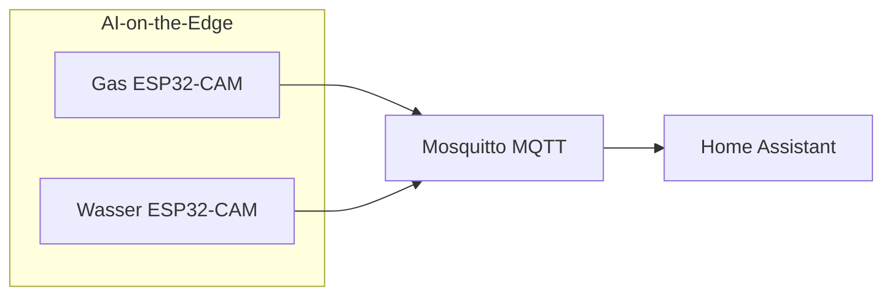

# AI-on-the-Edge: Gas- & Wasserzähler

Zwei **AI-on-the-Edge-Device** (ESP32-CAM + KI-Erkennung) lesen analoge Gas- und Wasserzähler aus und publizieren Werte per **MQTT** (Mosquitto). Home Assistant bindet sie über die **MQTT-Integration** (Auto-Discovery) ein.

**Nicht verwechseln:** Grünbeck / Softliq (Enthärtung) — separates Thema, keine AIoT-Zähler.

## Ziel

- Verbrauchswerte (Gas m³, Wasser m³) zuverlässig in HA und im **Energie-Dashboard**
- Fehler früh erkennen (Erkennungsproblem, Gerät offline)
- Diagnose-Entities aus Recorder/Logbook filtern (bereits umgesetzt)

## Architektur



| Schicht | Ort | Hinweis |
|---------|-----|---------|
| Gerät / KI | ESP32 je Zähler | Konfigurationsoberfläche AI-on-the-Edge im LAN (siehe unten) |
| Transport | Mosquitto Add-on | siehe [`integrationen-und-addons.md`](./integrationen-und-addons.md) |
| HA | MQTT-Integration (UI) | Geräte `gasmeter` / `watermeter`, Plattform `mqtt` |
| YAML | `configuration.yaml` | `customize`, Template `watermeter_in_l`, Recorder/Logbook-Filter |

Geräte-Pairing und MQTT-Broker-Zugang bleiben **UI/Add-on** — nicht in Git.

## Geräte im LAN (Web-UI)

Konfiguration, ROI, WLAN, MQTT und Firmware laufen auf der **AI-on-the-Edge-Oberfläche** des jeweiligen ESP32 — nicht in Home Assistant.

| Zähler | MQTT-ID | Web-UI (LAN) | Hinweis |
|--------|---------|--------------|---------|
| **Wasser** | `watermeter` | http://192.168.188.121/ | Konfigurationsoberfläche; bei MQTT-/Erkennungsproblemen zuerst hier prüfen |
| **Gas** | `gasmeter` | http://192.168.188.122/ | Konfigurationsoberfläche; bei MQTT-/Erkennungsproblemen zuerst hier prüfen |

Typische Aufgaben in der Web-UI: Live-Bild / ROI, Digitizer-Status, MQTT-Broker testen, Gerät neu starten, Referenzwert setzen.

---

## Live-Status (Abgleich 2026-05-27)

Prüfung über `.storage/core.restore_state` (letzte persistierte HA-States).

| Zähler | Status | Haupt-Entity | Letzter Wert | Zuletzt aktualisiert (UTC) |
|--------|--------|--------------|--------------|----------------------------|
| **Gas** | ✅ liefert Daten | `sensor.gasmeter_value` | **9970,940 m³** | 2026-05-27 11:32 |
| **Wasser** | ✅ | `sensor.watermeter_value` | **148,6785 m³** | 2026-05-27 ~12:17 |

### Gas (Detail)

| Entity | State (Stand Abgleich) |
|--------|-------------------------|
| `sensor.gasmeter_value` | 9970.940 m³ |
| `sensor.gasmeter_error` | `no error` |
| `sensor.gasmeter_status` | `Digitization of ROIs` (normaler Betrieb) |
| `binary_sensor.gasmeter_problem` | `off` |
| `sensor.gasmeter_rate_per_time_unit` | 0.576 m³/h (Momentanverbrauch) |

Einige **Diagnose-Entities** melden `unknown` (`sensor.gasmeter_ip`, `hostname`, `fwversion`, …) — der **Zählerwert** und JSON-Payload kommen trotzdem an.

### Wasser (Detail)

Alle MQTT-Entities des Geräts `watermeter` sind **`unavailable`**, inkl.:

- `sensor.watermeter_value`, `sensor.watermeter_error`, `sensor.watermeter_status`
- `binary_sensor.watermeter_problem`
- abgeleitet: `sensor.watermeter_in_l` (Template, availability = false)

**Vermutliche Ursachen (Priorität):** ESP offline / kein MQTT mehr, Strom/WLAN am Gerät, ROI-Kalibrierung, Broker-Credentials auf dem Gerät.

**Nächster Schritt (Betrieb, nicht YAML):** [Web-UI Wasserzähler](http://192.168.188.121/) → MQTT-Test → ggf. Neustart / ROI / WLAN.

---

## Entities (Referenz)

### Gas — MQTT-Gerät `gasmeter`

| Entity | Rolle | Recorder |
|--------|--------|----------|
| `sensor.gasmeter_value` | **Hauptwert** m³, `total_increasing` | ✅ aufgenommen |
| `binary_sensor.gasmeter_problem` | Problem-Flag (Discovery) | ✅ |
| `sensor.gasmeter_error` | Text-Fehler (`no error` = ok) | excluded |
| `sensor.gasmeter_status` | Betriebsstatus | excluded (Logbook) |
| `sensor.gasmeter_raw` | Rohwert | excluded |
| `sensor.gasmeter_rate_per_time_unit` | m³/h | excluded |
| `sensor.gasmeter_json` | Vollständiger Payload | excluded |
| `sensor.gasmeter_uptime`, `_ip`, `_wifirssi`, … | Diagnose | excluded |

`configuration.yaml` → `homeassistant.customize`: `sensor.gasmeter_value` mit `device_class: gas`.

### Wasser — MQTT-Gerät `watermeter`

| Entity | Rolle | Recorder |
|--------|--------|----------|
| `sensor.watermeter_value` | **Hauptwert** m³, `device_class: water` | ✅ (wenn online) |
| `binary_sensor.watermeter_problem` | Problem-Flag | ✅ |
| `sensor.watermeter_error` | Text-Fehler | excluded |
| `sensor.watermeter_in_l` | **Template** m³ → Liter (× 1000) | ✅ (wenn Quelle online) |
| Diagnose (`_uptime`, `_ip`, …) | wie Gas | excluded |

Template in [`configuration.yaml`](../configuration.yaml):

```yaml
- name: "Watermeter in l"
  unique_id: watermeter_in_l
  state: "{{ states('sensor.watermeter_value')|float(default=0) * 1000 }}"
  availability: "{{ states('sensor.watermeter_value') not in ['unknown', 'unavailable', 'none'] }}"
```

**Abweichung Google-Doc-Archiv:** dort teils `water_meter_liters` — in HA heißt die Entity **`sensor.watermeter_in_l`**.

### Legacy / unklar

| Entity | Hinweis |
|--------|---------|
| `sensor.gasmeter_value_2`, `sensor.gasmeter_in_kwh2`, … | Zweitkanal / Experiment — Recorder excluded, nicht für Energie-Dashboard nutzen ohne Klärung |
| `sensor.watermeter_value_2`, … | analog |

---

## Verhalten (Soll)

### Normalbetrieb

- AIoT sendet in konfiguriertem Intervall MQTT → HA aktualisiert `*_value`
- Gas: Energie-Dashboard nutzt `sensor.gasmeter_value` (Gas, monoton steigend)
- Wasser: Energie-Dashboard nutzt `sensor.watermeter_value` oder `sensor.watermeter_in_l` (Wasser)

### Fehler & Offline

| Situation | Erkennung | Reaktion |
|-----------|-----------|----------|
| Erkennungsfehler | `sensor.*_error` ≠ `no error` oder `binary_sensor.*_problem` = `on` | [`haus-warnungen.md`](./haus-warnungen.md) |
| Gerät offline / stale | `sensor.*_value` offline oder kein Update > 45 Min | [`haus-warnungen.md`](./haus-warnungen.md) |

**Ist:** umgesetzt via [`haus-warnungen.md`](./haus-warnungen.md) (`binary_sensor.*_warnung`, Tablett, `notify.haus_warnungen`).

### Randfälle

- **HA-Neustart:** MQTT-States kommen nach Broker-Reconnect zurück; Template `watermeter_in_l` folgt der Quelle
- **Manuelle Zählerablesung:** AIoT-ROI ggf. neu justieren (Geräte-Web-UI), nicht in HA
- **Recorder:** Nur `*_value`, Problem-Binary und Template sinnvoll langfristig; Rest bewusst excluded

---

## Energie-Dashboard

| Medium | Empfohlene Entity | Bemerkung |
|--------|-------------------|-----------|
| Gas | `sensor.gasmeter_value` | `device_class: gas` via customize |
| Wasser | `sensor.watermeter_value` | m³; alternativ Liter-Template für Anzeige |

Nach Wiederherstellung Wasserzähler: in **Einstellungen → Energie** prüfen, ob Wasser-Quelle noch verknüpft ist und Historie weiterläuft.

---

## YAML-Anker (bereits im Repo)

| Datei | Inhalt |
|-------|--------|
| `configuration.yaml` | `customize` Gas, Template `watermeter_in_l`, `recorder`/`logbook` exclude-Listen |
| `secrets.yaml` | MQTT-Passwörter (Add-on), **nicht** committen |

InfluxDB-`include` listet AIoT-Entities **nicht** — Langzeit speichert MariaDB-Recorder für die Hauptwerte.

---

## UI (optional, Backlog)

- Kompakte Mushroom-Karten auf Übersicht oder eigenes Mini-Dashboard: Gas/Wasser Stand + Problem-Icon
- Kein separates Wasser-Dashboard in Storage mehr (bewusst entfernt)

---

## Abnahme-Checkliste

- [ ] Gas: `sensor.gasmeter_value` numerisch, steigt bei Verbrauch
- [ ] Gas: `sensor.gasmeter_error` = `no error`, `binary_sensor.gasmeter_problem` = `off`
- [ ] Wasser: `sensor.watermeter_value` ≠ `unavailable` (aktuell **offen**)
- [ ] Wasser: `sensor.watermeter_in_l` folgt Wert × 1000
- [ ] Energie-Dashboard: Gas + Wasser mit korrekter Einheit
- [ ] (Backlog) Push bei Problem / Offline

---

## Backlog

- [ ] Energie-Dashboard-Vollständigkeit prüfen
- [ ] Optional: Mushroom-Karten auf [`dashboard-uebersicht.md`](./dashboard-uebersicht.md)
- [ ] Legacy-Entities `*_value_2` / `gasmeter_in_kwh2` klären oder entfernen

---

## Siehe auch

- [`integrationen-und-addons.md`](./integrationen-und-addons.md) — Mosquitto, MQTT
- [`archiv-gdocs.md`](./archiv-gdocs.md) — ältere Notizen (Entity-Namen teils veraltet)
- [`logging-audit.md`](./logging-audit.md) — Recorder/Template-Stabilität
