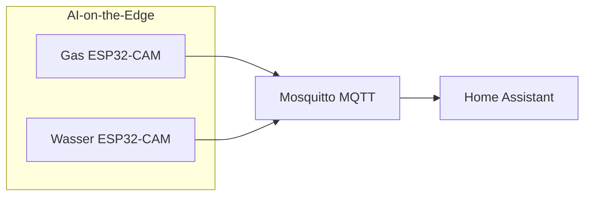

# AI-on-the-Edge: Gas- & Wasserzähler

Zwei **AI-on-the-Edge-Device** (ESP32-CAM + KI-Erkennung) lesen analoge Gas- und Wasserzähler aus und publizieren Werte per **MQTT** (Mosquitto). Home Assistant bindet sie über die **MQTT-Integration** (Auto-Discovery) ein.

**Nicht verwechseln:** Grünbeck / Softliq (Enthärtung) — separates Thema, keine AIoT-Zähler.

## Ziel

- Verbrauchswerte (Gas m³, Wasser m³) zuverlässig in HA und im **Energie-Dashboard**
- Fehler früh erkennen (Erkennungsproblem, Gerät offline)
- Diagnose-Entities aus Recorder/Logbook filtern (bereits umgesetzt)

## Architektur



| Schicht | Ort | Hinweis |
|---------|-----|---------|
| Gerät / KI | ESP32 je Zähler | Konfigurationsoberfläche AI-on-the-Edge im LAN (siehe unten) |
| Transport | Mosquitto Add-on | siehe [`integrationen-und-addons.md`](./integrationen-und-addons.md) |
| HA | MQTT-Integration (UI) | Geräte `gasmeter` / `watermeter`, Plattform `mqtt` |
| YAML | `configuration.yaml` | `customize`, Template `watermeter_in_l`, Recorder/Logbook-Filter |

Geräte-Pairing und MQTT-Broker-Zugang bleiben **UI/Add-on** — nicht in Git.

## Geräte im LAN (Web-UI)

Konfiguration, ROI, WLAN, MQTT und Firmware laufen auf der **AI-on-the-Edge-Oberfläche** des jeweiligen ESP32 — nicht in Home Assistant.

| Zähler | MQTT-ID | Web-UI (LAN) | Hinweis |
|--------|---------|--------------|---------|
| **Wasser** | `watermeter` | http://192.168.188.121/ | Konfigurationsoberfläche; bei MQTT-/Erkennungsproblemen zuerst hier prüfen |
| **Gas** | `gasmeter` | http://192.168.188.122/ | Konfigurationsoberfläche; bei MQTT-/Erkennungsproblemen zuerst hier prüfen |

### SD-Karten (Betrieb, 2026-06-07)

| Zähler | SD aktuell | Ersatz bereit | Hinweis |
|--------|------------|---------------|---------|
| **Gas** | 4 GB SanDisk (getauscht) | — | Webhook in Web-UI deaktiviert (Crash-Ursache); läuft wieder |
| **Wasser** | **16 GB** (noch original) | **4 GB SanDisk** | Prophylaktischer Tausch **ausstehend** — erst bei erneuten Problemen; dann Backup `wlan.ini` + `config/` vom Wasser-ESP, nicht Gas-Config kopieren |

Typische Aufgaben in der Web-UI: Live-Bild / ROI, Digitizer-Status, MQTT-Broker testen, Gerät neu starten, Referenzwert setzen.

---

## Live-Status (Abgleich 2026-05-27)

Prüfung über `.storage/core.restore_state` (letzte persistierte HA-States).

| Zähler | Status | Haupt-Entity | Letzter Wert | Zuletzt aktualisiert (UTC) |
|--------|--------|--------------|--------------|----------------------------|
| **Gas** | ✅ liefert Daten | `sensor.gasmeter_value` | **~9983 m³** | 2026-06-08 (Statistik repariert) |
| **Wasser** | ✅ | `sensor.watermeter_value` | **~150,37 m³** | 2026-06-08 (wieder online) |

### Gas (Detail)

| Entity | State (Stand Abgleich) |
|--------|-------------------------|
| `sensor.gasmeter_value` | 9970.940 m³ |
| `sensor.gasmeter_error` | `no error` |
| `sensor.gasmeter_status` | `Digitization of ROIs` (normaler Betrieb) |
| `binary_sensor.gasmeter_problem` | `off` |
| `sensor.gasmeter_rate_per_time_unit` | 0.576 m³/h (Momentanverbrauch) |

Einige **Diagnose-Entities** melden `unknown` (`sensor.gasmeter_ip`, `hostname`, `fwversion`, …) — der **Zählerwert** und JSON-Payload kommen trotzdem an.

### Wasser (Detail)

**Stand 2026-06-08:** wieder **online** (~150 m³). Gelegentlich OCR-Fehler (`Rate too high`, kurz `binary_sensor.watermeter_problem`) — können Energie-**Statistik** verfälschen; Reparatur: `bin/repair-watermeter-statistics.sh` (siehe Energie-Dashboard-Abschnitt).

Bei erneutem Offline: [Web-UI Wasserzähler](http://192.168.188.121/) → MQTT-Test → Strom/WLAN; Webhook deaktiviert lassen (wie Gas).

---

## Entities (Referenz)

### Gas — MQTT-Gerät `gasmeter`

| Entity | Rolle | Recorder |
|--------|--------|----------|
| `sensor.gasmeter_value` | **Hauptwert** m³, `total_increasing` | ✅ aufgenommen |
| `binary_sensor.gasmeter_problem` | Problem-Flag (Discovery) | ✅ |
| `sensor.gasmeter_error` | Text-Fehler (`no error` = ok) | excluded |
| `sensor.gasmeter_status` | Betriebsstatus | excluded (Logbook) |
| `sensor.gasmeter_raw` | Rohwert | excluded |
| `sensor.gasmeter_rate_per_time_unit` | m³/h | excluded |
| `sensor.gasmeter_json` | Vollständiger Payload | excluded |
| `sensor.gasmeter_uptime`, `_ip`, `_wifirssi`, … | Diagnose | excluded |

`configuration.yaml` → `homeassistant.customize`: `sensor.gasmeter_value` mit `device_class: gas`.

### Wasser — MQTT-Gerät `watermeter`

| Entity | Rolle | Recorder |
|--------|--------|----------|
| `sensor.watermeter_value` | **Hauptwert** m³, `device_class: water` | ✅ (wenn online) |
| `binary_sensor.watermeter_problem` | Problem-Flag | ✅ |
| `sensor.watermeter_error` | Text-Fehler | excluded |
| `sensor.watermeter_in_l` | **Template** m³ → Liter (× 1000) | ✅ (wenn Quelle online) |
| Diagnose (`_uptime`, `_ip`, …) | wie Gas | excluded |

Template in [`configuration.yaml`](../configuration.yaml):

```yaml
- name: "Watermeter in l"
  unique_id: watermeter_in_l
  state: "{{ states('sensor.watermeter_value')|float(default=0) * 1000 }}"
  availability: "{{ states('sensor.watermeter_value') not in ['unknown', 'unavailable', 'none'] }}"
```

**Abweichung Google-Doc-Archiv:** dort teils `water_meter_liters` — in HA heißt die Entity **`sensor.watermeter_in_l`**.

### Legacy / unklar

| Entity | Hinweis |
|--------|---------|
| `sensor.gasmeter_value_2`, `sensor.gasmeter_in_kwh2`, … | Zweitkanal / Experiment — Recorder excluded, nicht für Energie-Dashboard nutzen ohne Klärung |
| `sensor.watermeter_value_2`, … | analog |

---

## Verhalten (Soll)

### Normalbetrieb

- AIoT sendet in konfiguriertem Intervall MQTT → HA aktualisiert `*_value`
- Gas: Energie-Dashboard nutzt `sensor.gasmeter_value` (Gas, monoton steigend)
- Wasser: Energie-Dashboard nutzt `sensor.watermeter_value` oder `sensor.watermeter_in_l` (Wasser)

### Fehler & Offline

| Situation | Erkennung | Reaktion |
|-----------|-----------|----------|
| Erkennungsfehler | `sensor.*_error` ≠ `no error` oder `binary_sensor.*_problem` = `on` | [`haus-warnungen.md`](./haus-warnungen.md) |
| Gerät offline / stale | `sensor.*_value` offline oder kein Update > 45 Min | [`haus-warnungen.md`](./haus-warnungen.md) |

**Ist:** umgesetzt via [`haus-warnungen.md`](./haus-warnungen.md) (`binary_sensor.*_warnung`, Tablett, `notify.haus_warnungen`).

### Randfälle

- **HA-Neustart:** MQTT-States kommen nach Broker-Reconnect zurück; Template `watermeter_in_l` folgt der Quelle
- **Manuelle Zählerablesung:** AIoT-ROI ggf. neu justieren (Geräte-Web-UI), nicht in HA
- **Recorder:** Nur `*_value`, Problem-Binary und Template sinnvoll langfristig; Rest bewusst excluded

---

## Energie-Dashboard

| Medium | Empfohlene Entity | Bemerkung |
|--------|-------------------|-----------|
| Gas | `sensor.gasmeter_value` | `device_class: gas` via customize |
| Wasser | `sensor.watermeter_value` | m³; alternativ Liter-Template für Anzeige |

Nach Wiederherstellung Wasserzähler: in **Einstellungen → Energie** prüfen, ob Wasser-Quelle noch verknüpft ist und Historie weiterläuft.

### DB-Restore vor Statistik-Reparatur (2026-06-08)

Wenn Reparaturläufe die Historie verschlimmert haben: **MariaDB-Add-on** aus dem automatischen Backup **vom 08.06. früh** wiederherstellen (nicht Home-Assistant-Config):

```bash
ha backups restore <slug> --homeassistant=false --app core_mariadb
```

Passwort: Einstellungen → System → Backups (oder Notfall-Kit). Danach **Core neu starten** (`ha core restart`). Erst dann Reparatur-Skripte — **jeweils einmal**, nie auf bereits reparierte Daten erneut anwenden.

Sicherungsdump vor Restore optional: `mariadb-dump … homeassistant > /tmp/ha_db_sicherung.sql`

### Statistik-Reparatur (MariaDB, 2026-06-08)

**Symptom:** Energie-Dashboard zeigt unrealistische Tageswerte (z. B. **−776 m³** oder **+750 m³**), obwohl der Zählerstand plausibel bei ~150 m³ liegt.

**Ursache:** OCR-Ausreißer der AI-on-the-Edge (falsche Ziffern, z. B. `750` statt `150`) und Offline-Lücken haben die Recorder-**Statistik** (`statistics` / `statistics_short_term`) verfälscht — nicht die Live-Entity `sensor.watermeter_value`.

**Reparatur (Betrieb):**

```bash
DB_PASS='…' /config/bin/repair-watermeter-statistics.sh
```

Das Skript:

- bereinigt `sensor.watermeter_value` (Sprung-Filter: max. **+2 m³/h**, max. **−0,2 m³/h**; nach **>48 h** Lücke bis **+15 m³** erlaubt — **kein** absoluter m³-Obergrenze)
- setzt `sum` als kumulierten Verbrauch neu
- synchronisiert `sensor.watermeter_value_cost` (× Wasserpreis **3,52**, inkl. Backfill fehlender Kosten-Zeilen via `sync-gasmeter-cost.sh`)

**Nach dem Lauf:** Energie-Dashboard im Browser neu laden (ggf. Cache leeren). Live-Zählerstand unverändert.

**Backlog:** Gefilterter Sensor (`sensor.watermeter_value_stabil`) für künftige Ausreißer — siehe Chat 2026-06-08.

### Statistik-Reparatur Gas (MariaDB, 2026-06-08)

**Präventiv geprüft** — aktuelle Werte (Mai/Juni 2026) sauber (~0,1–2 m³/Tag), Live-Zähler ~9983 m³.

**Historisch:** OCR-Korruption ab 04/2024 (Rohwerte bis 77 260 m³); Ausreißer **18.01.2026** (~47 m³/Tag, Sprung 9352→9399). `sensor.gasmeter_value_2` ist **unvollständig** (nur bis 12/2024) — **nicht** als Reparatur-Quelle nutzen.

**Reparatur (Betrieb):** Nur auf **unveränderten** Recorder-Daten (z. B. direkt nach DB-Restore):

```bash
DB_PASS='…' /config/bin/repair-gasmeter-statistics.sh
```

Das Skript:

- liest Rohwerte **nur** aus `statistics` / `statistics_short_term` für `sensor.gasmeter_value` (metadata 848)
- Sprung-Filter: max. **+3 m³/h**, max. **−0,2 m³/h**; nach **>48 h** ohne gültigen Wert bis **+30 m³** oder Wiederanbindung (Zähler-Sprung von OCR-Plateau auf echten Bereich >5000 m³)
- OCR-Spikes: Sprünge **>10 m³** zwischen benachbarten Stunden werden verworfen
- setzt `sum` neu; synchronisiert `sensor.gasmeter_value_cost` (× **1,32**)
- **Kosten:** `cost.state`/`cost.sum` aus **`val.sum` × Preis** (Verbrauch `sum`, nicht Zählerstand `state`). Perioden im Dashboard = **Deltas** der `sum`-Spalte (~130–200 €/Monat); absoluter `cost.state` ist kumulativ seit 2024 (~12.000 €) — nicht als Monatskosten lesen.
- **Fehlende Kosten-Zeilen:** `sensor.gasmeter_value_cost` wird erst ab **01/2026** von HA befüllt. Ohne Backfill: **m³ in 2025 sichtbar, Kosten 0 €**. `sync-gasmeter-cost.sh` legt fehlende Zeilen für alle `gasmeter_value`-Stunden an.
- **`short_term`-sum:** muss dieselbe kumulative Basis wie **hourly** haben (Skript koppelt an hourly). Sonst leerer Mai im Dashboard oder **−9 m³** am 08.06., wenn HA `short_term` wieder überschreibt → Reparatur-Skript erneut ausführen

**Nur Kosten (ohne Zähler-Reparatur):**

```bash
DB_PASS='…' /config/bin/sync-gasmeter-cost.sh
```

Optional: `GAS_PRICE`, `META_ID_VALUE`, `META_ID_COST` (Wasser: `1083`/`1082`, Preis `3.52`).

**Nach dem Lauf:** Energie-Dashboard neu laden (Strg+F5). Live-Entity unverändert.

**Wichtig:** Skript **nicht** auf bereits reparierte/kaputte Statistik erneut ausführen — bei Fehlschlag zuerst DB-Restore, dann **einmal** reparieren.

---

## YAML-Anker (bereits im Repo)

| Datei | Inhalt |
|-------|--------|
| `configuration.yaml` | `customize` Gas, Template `watermeter_in_l`, `recorder`/`logbook` exclude-Listen |
| `secrets.yaml` | MQTT-Passwörter (Add-on), **nicht** committen |

InfluxDB-`include` listet AIoT-Entities **nicht** — Langzeit speichert MariaDB-Recorder für die Hauptwerte.

---

## UI (optional, Backlog)

- Kompakte Mushroom-Karten auf Übersicht oder eigenes Mini-Dashboard: Gas/Wasser Stand + Problem-Icon
- Kein separates Wasser-Dashboard in Storage mehr (bewusst entfernt)

---

## Abnahme-Checkliste

- [ ] Gas: `sensor.gasmeter_value` numerisch, steigt bei Verbrauch
- [ ] Gas: `sensor.gasmeter_error` = `no error`, `binary_sensor.gasmeter_problem` = `off`
- [x] Wasser: `sensor.watermeter_value` ≠ `unavailable` (seit 2026-06-08)
- [ ] Wasser: `sensor.watermeter_in_l` folgt Wert × 1000
- [ ] Energie-Dashboard: Gas + Wasser mit korrekter Einheit
- [ ] (Backlog) Push bei Problem / Offline

---

## Backlog

- [ ] **Wasser-SD:** 16 GB → 4 GB SanDisk tauschen, wenn `watermeter` wieder spinnt/offline (Ersatzkarte liegt bereit; Vorgehen wie Gas-Migration, aber **Wasser-`config/`** vom Backup)
- [ ] Energie-Dashboard-Vollständigkeit prüfen
- [ ] Optional: Mushroom-Karten auf [`dashboard-uebersicht.md`](./dashboard-uebersicht.md)
- [ ] Legacy-Entities `*_value_2` / `gasmeter_in_kwh2` klären oder entfernen

---

## Siehe auch

- [`integrationen-und-addons.md`](./integrationen-und-addons.md) — Mosquitto, MQTT
- [`archiv-gdocs.md`](./archiv-gdocs.md) — ältere Notizen (Entity-Namen teils veraltet)
- [`logging-audit.md`](./logging-audit.md) — Recorder/Template-Stabilität
