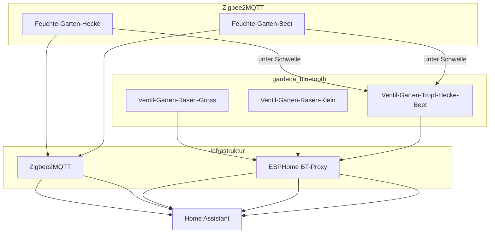

# Garten: Bewässerung (Zigbee-Feuchte + Gardena Bluetooth-Ventile)

Spec für Bodenfeuchte und drei Bewässerungszonen im Garten. Ersetzt die frühere **Gardena Smart System**-Welt (Cloud + Smart Gateway) ohne neuen Hub.

**Verwandt:** [`integrationen-und-addons.md`](./integrationen-und-addons.md) · [`standards.md`](./standards.md) · [`raeume-und-bereiche.md`](./raeume-und-bereiche.md)

---

## Ziel

- **Hecke + Beet:** Bodenfeuchte per **Zigbee** (Zigbee2MQTT), Tropfbewässerung per **Gardena BT-Ventil** — optional automatisch bei Trockenheit
- **Rasen (2 Zonen):** zwei weitere BT-Ventile — manuell oder später Zeit/Wetter (kein Bodenfeuchte-Sensor am Rasen)
- **Kein Gardena Smart Gateway** — alte `gardena_smart_system`-Geräte aufräumen

---

## Architektur

| Funktion | Hardware | Integration |
|----------|----------|-------------|
| Bodenfeuchte Hecke | **Tuya SGS01Z** (TS0601_soil_3, IP67) | Zigbee2MQTT |
| Bodenfeuchte Beet | **Tuya SGS01Z** (TS0601_soil_3, IP67) | Zigbee2MQTT |
| Topfpflanzen innen (3×) | **ThirdReality** 3RSM0147Z / Gen2 | Zigbee2MQTT (nur Anzeige, keine Automation V1) |
| Zone A — großer Regner | Gardena 1285-20 | `gardena_bluetooth` → `valve.*` |
| Zone B — 2 kleine Regner | Gardena 1285-20 | `gardena_bluetooth` |
| Zone C — Tropf Hecke/Beet | Gardena 1285-20 | `gardena_bluetooth` |
| BLE-Reichweite Garten | **ESPHome Atom am EG-Fenster** (`atom-bluetooth-proxy-eg-garten.yaml`) | ESPHome — **active scanning** |
| BLE sonst | Atom 1.OG / 2.OG (passiv) | [`esphome/atom-bluetooth-proxy-*.yaml`](../esphome/) |

**Abgrenzung:** `gardena_smart_system` (HACS, Cloud) ≠ `gardena_bluetooth` (Core, lokal). Alte **GARDENA smart Sensor** (868 MHz → Gateway) sind ohne Hub wertlos — **nicht** per Zigbee umnutzbar.

---

## Bewässerungszonen

| Zone | Bewässerung | Steuerung | Friendly Name (Ventil) |
|------|-------------|-----------|------------------------|
| **A** | [Gardena Viereckregner OS 140](https://www.bauhaus.info/viereckregner/gardena-sprinklersystem-viereckregner-os-140/p/27135992) — großer Rasen | Manuell / später Zeit-Wetter | `Ventil-Garten-Rasen-Gross` |
| **B** | 2× [Gardena Versenkregner SD80](https://www.globus-baumarkt.de/p/gardena-versenkregner-sd80-0692152303/) — kleiner Rasen | Manuell / später Zeit-Wetter | `Ventil-Garten-Rasen-Klein` |
| **C** | Tropfschläuche Hecke + Beet | Feuchte-Automation + manuell | `Ventil-Garten-Tropf-Hecke-Beet` |

### Ventil-Mapping (Stand 2026-06-14)

| HA-Gerät (Pairing #) | MAC | Zone | Bewässerung | HA `entity_id` (Ventil) |
|----------------------|-----|------|-------------|---------------------------|
| #1 | `CC:B5:4C:AC:75:7B` | A | Viereckregner OS 140 | `valve.ventil_garten_rasen_gross` |
| #2 | `CC:B5:4C:4B:DC:87` | C | Tropf Hecke/Beet *(Leck derzeit — erst reparieren)* | `valve.ventil_garten_tropf_hecke_beet` |
| #3 | `CC:B5:4C:AC:72:EE` | B | 2× Versenkregner SD80 | `valve.ventil_garten_rasen_klein` |

Gehäuse am Ventil mit Zone **A / B / C** beschriften (nicht Pairing-# — #2 ist Tropf, nicht „zweiter Regner“).

**Testprotokoll:**

1. Alle Ventile: Batterie raus → Factory Reset ([HA-Doku](https://www.home-assistant.io/integrations/gardena_bluetooth/): Man.-Taste + Batterie ~10 s)
2. Nur **Ventil 1** in HA unter **Einstellungen → Geräte & Dienste → Gardena Bluetooth** hinzufügen
3. In HA **30 s** `valve.open` → beobachten welcher Regner/Tropf läuft
4. Gerät umbenennen (Friendly Name laut Tabelle), Area **Garten**
5. Batterie raus am getesteten Ventil; **Ventil 2** pairen → wiederholen
6. Ventil 3 analog; Tabelle oben vervollständigen; Gehäuse beschriften

**Details zum Ablauf:** Abschnitt [Lösung — Erfolgsrezept](#lösung--erfolgsrezept-stand-2026-06) (nRF Connect, Entkoppeln, Custom Integration, LED-Verhalten).

---

## Zigbee-Bodenfeuchte

### Bestand (gekauft)

| Einsatz | Stück | Modell | Z2M |
|---------|-------|--------|-----|
| **Garten** Hecke + Beet | 2× | **Tuya SGS01Z** (TS0601_soil_3, IP67) | [TS0601_soil_3](https://www.zigbee2mqtt.io/devices/TS0601_soil_3.html) |
| **Innen** Topfpflanzen | 3× | **ThirdReality** 3RSM0147Z oder Gen2 3RSM0347Z | [3RSM0147Z](https://www.zigbee2mqtt.io/devices/3RSM0147Z.html) |

**Aufteilung:** Tuya **ungeschützt draußen** (Regen) — IP67. ThirdReality **innen** in Töpfen — kein Wasserschutz nötig, reicht für Raum-/Topf-Einsatz; Werte eher als Trend lesen.

- **Hecke:** Tuya in typischer Tropfzone
- **Beet:** Tuya im Beet
- **Innen:** ThirdReality pro Topfpflanze — `friendly_name` nach Raum/Ort (siehe unten)
- Rasen: **keine** Sensoren (Regner ≠ sinnvolle Messstelle)

### Tuya outdoor — Hinweise

- In Z2M unter **Settings (Specific)** optional `soil_moisture_calibration` / `temperature_calibration`
- **Batterie-%** kann beim Tuya **bis ~24 h** brauchen, bis der erste Wert kommt — normal
- Pairing **am finalen Standort** im Garten (Reichweite!)

### Zigbee-Netzwerk

Aktuell keine Outdoor-Geräte in Z2M — **Reichweite planen:**

1. Zigbee-Router nahe Garten (z. B. Steckdose am EG-Fenster zur Terrasse)
2. Pairing **am finalen Standort**
3. `linkquality` in Zigbee2MQTT beobachten (Ziel: stabil > 100)

### Pairing Garten (Tuya)

1. Z2M: **Permit join** an (`switch.zigbee2mqtt_bridge_permit_join`)
2. Sensor am Standort aktivieren (Batterie)
3. In `zigbee2mqtt/configuration.yaml` unter `devices:` — **`friendly_name` setzen:**
   - `Feuchte-Garten-Hecke`
   - `Feuchte-Garten-Beet`
4. HA: Area **Garten**
5. Nach 1–2 Wochen Schwellwerte in `input_number.garten_schwellwert_*` kalibrieren (Trend wichtiger als absolute %)

### Pairing innen (ThirdReality)

1. **In der Nähe eines Zigbee-Routers** pairen (Wohnbereich — kein Outdoor-Router nötig)
2. **`friendly_name`** nach Raum/Ort, z. B.:
   - `Feuchte-EG-Wohnzimmer-Pflanze` (Platzhalter — beim Einbau anpassen)
   - weitere nach Bedarf
3. HA: passende **Area** (nicht Garten)
4. **Keine** Anbindung an Garten-Automationen in V1 — nur Dashboard/Anzeige optional später

### Erwartete Entities Garten (Z2M → HA)

| Z2M friendly_name | HA entity_id (typisch) |
|-------------------|------------------------|
| `Feuchte-Garten-Hecke` | `sensor.feuchte_garten_hecke_soil_moisture`, `_temperature`, `_battery` |
| `Feuchte-Garten-Beet` | `sensor.feuchte_garten_beet_soil_moisture`, `_temperature`, `_battery` |

Abweichende IDs nach Pairing in dieser Tabelle nachtragen.

### Erwartete Entities innen (ThirdReality, Beispiel)

| Z2M friendly_name (Beispiel) | HA entity_id (typisch) |
|------------------------------|------------------------|
| `Feuchte-EG-Wohnzimmer-Pflanze` | `sensor.feuchte_eg_wohnzimmer_pflanze_soil_moisture`, … |

Namen beim Pairing festlegen; **keine feste YAML-Abhängigkeit** in V1.

---

## Gardena Bluetooth-Ventile

- Modell: **Bewässerungsventil 9 V Bluetooth (1285-20)**
- Firmware: **≥ 1.7.23.29** (Update ggf. einmalig über Gardena Bluetooth App vor Factory Reset)
- Integration: **Gardena Bluetooth** (Core, nicht HACS)
- Entity-Typ: **`valve`** (`valve.open` / `valve.close`)

### BLE-Infrastruktur

| Proxy | Datei | Modus | Standort |
|-------|-------|-------|----------|
| **EG Garten** | `esphome/atom-bluetooth-proxy-eg-garten.yaml` | **active scanning** (Pairing + Ventile) | EG-Fenster zum Garten (seit 06/2026) |
| 1. OG | `esphome/atom-bluetooth-proxy-2-1og.yaml` | passiv | 1. OG |
| 2. OG | `esphome/atom-bluetooth-proxy-3-2og.yaml` | passiv | 2. OG |

HA-Anzeigename EG-Proxy: **Bluetooth Proxy EG Garten** (`friendly_name`). ESPHome-Hostname bleibt `atom-bluetooth-proxy-1-keller` (OTA-Stabilität).

**OTA nach YAML-Änderung:** Add-on **ESPHome Device Builder** → `atom-bluetooth-proxy-eg-garten.yaml` → **Install** (Over-The-Air). Grund: Active/Passive-Scanning liegt in der **ESP-Firmware**, nicht in HA.

Bei Verbindungsproblemen nur am **EG-Proxy** active lassen; 1.OG/2.OG können passiv bleiben.

### Lösung — Erfolgsrezept (Stand 2026-06)

So sind die **3× Gardena 1285-20** zuverlässig in Home Assistant gelandet. Reihenfolge und Entkopplung waren entscheidend — nicht nur Factory Reset.

#### Kurzfassung

| Baustein | Was wir nutzen |
|----------|----------------|
| BLE-Reichweite Garten | ESPHome **Atom EG-Fenster**, **Active Scanning** (YAML + HA-UI) |
| Integration in HA | **`custom_components/gardena_bluetooth/`** — Anzeige **„Gardena Bluetooth (Proxy Fix)“** (Workaround bis Core-Patch merged) |
| Diagnose am Ventil | **nRF Connect** auf dem Handy (Nordic Semiconductor, nicht „NFC“) |
| Steuerung | `valve.open` / `valve.close` — Skripte und Dashboard im Repo |
| Gardena-App danach | **Nicht parallel** — sonst sperrt die App HA aus dem BT-Pairing |

#### Einmalige Vorbereitung

1. **Firmware** am Ventil ≥ **1.7.23.29** (falls nötig: einmalig über **Gardena Bluetooth App** updaten, *bevor* alles für HA entkoppelt wird).
2. **ESPHome BT-Proxy EG:** `active: true` in [`atom-bluetooth-proxy-eg-garten.yaml`](../esphome/atom-bluetooth-proxy-eg-garten.yaml) → **OTA flashen** (Add-on ESPHome Device Builder).
3. **HA-UI:** Gerät **Bluetooth Proxy EG Garten** → Konfigurieren → **Bluetooth-Scanmodus: Active** (YAML allein reicht nicht immer).
4. **Custom Integration** im Repo belassen — Core-Integration allein scheitert oft mit *Unable to find product type* über ESPHome-Proxies (siehe unten).

#### Pro Ventil — Ablauf (der funktioniert hat)

1. **Alte Kopplungen entfernen**
   - War das Ventil in der **Gardena Bluetooth App** (oder am Handy) gekoppelt: dort **Gerät löschen / entkoppeln**.
   - **nRF Connect:** Ventil in der Geräteliste öffnen → falls **Connected** oder alte Bonding-Einträge: **Disconnect** / Verbindung trennen. Ohne diesen Schritt blieb Pairing in HA oft hängen oder scheiterte still.
2. **Factory Reset** ([HA-Doku](https://www.home-assistant.io/integrations/gardena_bluetooth/)): Man.-Taste halten → 9-V-Block einlegen → **~10 s** weiter halten → **blaue LED blinkt ~3 Min** (Pairing-Fenster).
3. **nRF Connect — Sichtbarkeit prüfen** (Ventil **< 2 m** vom EG-Proxy und Handy):
   - Gerät erscheint (Name/MAC, Service `98BD…`) → Ventil sendet; weiter mit HA.
   - Nichts sichtbar → Reset-Fenster abgelaufen, Batterie prüfen, Wähler **AUTO** (nicht OFF), Steuerteil auf Ventil.
4. **In HA hinzufügen:** **Einstellungen → Geräte & Dienste → Gardena Bluetooth (Proxy Fix) → Gerät hinzufügen** — **nur ein Ventil** gleichzeitig.
5. **Zone zuordnen:** `valve.open` **30 s** → beobachten welcher Regner/Tropf läuft → Friendly Name + Area **Garten** (Tabelle [Ventil-Mapping](#ventil-mapping-stand-2026-06-14)).
6. **Batterie raus** am getesteten Ventil → nächstes Ventil ab Schritt 1.

Ventile **nicht parallel** in der Gardena-App behalten — App kann HA aus dem BT-Pairing sperren.

#### nRF Connect — warum so hilfreich

- [Android](https://play.google.com/store/apps/details?id=no.nordicsemi.android.mcp) / [iOS](https://apps.apple.com/app/nrf-connect/id1051074755)
- Zeigt **alle** BLE-Geräte — unabhängig von HA und Gardena-App.
- **Werbung sichtbar?** Unterscheidet „Ventil tot“ vs. „HA/Proxy-Konfiguration“.
- **Entkoppeln:** Alte Handy-/App-Verbindung **vor** HA-Pairing trennen — in der Praxis oft der entscheidende Schritt.
- **Scan Response:** nRF (aktiv) sieht oft **Advertising + Scan Response**; ESPHome-Proxies leiten teils nur Advertising weiter → Grund für den Proxy-Fix (Herstellerdaten / Produkttyp).

#### Custom Integration — wann und warum

**Symptom:** Pairing startet, danach *Einrichtungsfehler: Unable to find product type*.

**Ursache:** Gardena sendet Service-UUID `98BD…` im Advertising; Herstellerdaten `0x0426` (Produkttyp) oft erst in der **Scan Response**. ESPHome-Proxies geben das nicht zuverlässig an HA weiter.

**Workaround (Repo):** `custom_components/gardena_bluetooth/` — akkumuliert Werbung über Scan-Service, **BLE-Connect-Fallback** für Produkttyp. Upstream-Patch vorbereitet: [`upstream-pr-gardena-bluetooth.md`](upstream-pr-gardena-bluetooth.md).

#### Normalbetrieb — **keine Bluetooth-LED** ist ok

Nach erfolgreichem HA-Pairing leuchten die Ventile **dauerhaft ohne blaue Verbindungs-LED** — das ist **normal** und kein Fehler.

- Steuerung läuft über den **ESPHome BT-Proxy** und HA, nicht über sichtbares „BT-Pairing“ am Gerät.
- **Nicht** erneut Factory Reset nur wegen fehlender LED — sonst Mapping und HA-Einträge verlieren.
- Kurztest: `valve.open` / Dashboard — Ventil reagiert → alles in Ordnung.

#### Ventil in HA „an“, aber physisch nichts passiert

| Prüfung | Hinweis |
|---------|---------|
| Richtige **Entity** nach Zone-Mapping | z. B. `valve.ventil_garten_rasen_gross`, nicht Pairing-Reihenfolge raten |
| **`manuelle_bewasserungszeit`** | Muss **> 0** sein (Ventil-Entity in HA) — bei 0 öffnet nichts |
| **Wähler am Ventil** | **AUTO**, nicht OFF |
| **9-V-Alkaliblock** | Frisch, Steuerteil korrekt auf Ventil |
| **Zone C Tropf** | Leitung derzeit undicht — Reparatur vor sinnvollem Test |

#### Wenn gar nichts geht

- Batterie **30 Min raus** (Entladung), **ein** Reset, sofort im Pairing-Fenster testen — nicht fünfmal hintereinander resetten.
- nRF Connect: weiterhin unsichtbar → Hardware/Reset; sichtbar, HA nicht → Proxy Active + Custom Integration prüfen.

---

### Gardena BT — Pairing & Fehlersuche (Referenz)

**nRF Connect** (nicht „NFC“): kostenlose App von Nordic Semiconductor ([Android](https://play.google.com/store/apps/details?id=no.nordicsemi.android.mcp) / [iOS](https://apps.apple.com/app/nrf-connect/id1051074755)). Zeigt **alle Bluetooth-Geräte** in der Nähe — Test, ob das Ventil nach Factory Reset überhaupt sendet.

**Factory Reset 1285** (Firmware ≥ 1.7.23.29 ✅):

1. **9-V-Alkaliblock** raus (kein Akku)
2. **Man.-Taste** halten, Batterie einlegen
3. **~10 s weiter** halten → **blaue Verbindungs-LED blinkt ~3 Min** (Pairing-Fenster)
4. Innerhalb dieser 3 Min: nRF Connect **oder** HA/Gardena-App — Ventil **< 2 m** vom **EG-Proxy** und Handy

| nRF Connect | HA Gardena Bluetooth |
|-------------|----------------------|
| Gerät sichtbar | Proxy/Scanning — Ventil ok, HA-Konfiguration prüfen |
| Nichts sichtbar | Reset-Fenster abgelaufen, Batterie, Wähler **AUTO/OFF**, Steuerteil auf Ventil |

**Typische HA-Falle:** Proxy hatte `active: False` → HA findet nichts. Zusätzlich in HA pro ESP-Proxy unter **Konfigurieren → Bluetooth-Scanmodus: Active** stellen (YAML `active: true` allein reicht nicht immer).

**Scan Response / „Unable to find product type“:** Das Ventil sendet Service-UUID `98BD…` im Advertising, Herstellerdaten `0x0426` (Produkttyp) oft erst in der **Scan Response** — nRF Connect (aktiv) sieht beides, ESP-Proxies leiten teils nur das Advertising weiter. Symptome: Pairing startet, danach *Einrichtungsfehler: Unable to find product type*.

**Workaround (Repo, bis Core-Patch merged):** Custom Integration `custom_components/gardena_bluetooth/` — akkumuliert Werbung über Scan-Service und ermittelt Produkttyp per BLE-Connect-Fallback. In HA als **„Gardena Bluetooth (Proxy Fix)“** sichtbar. Upstream-PR-Vorbereitung: [`upstream-pr-gardena-bluetooth.md`](upstream-pr-gardena-bluetooth.md), Patch unter [`upstream-patches/home-assistant-core/`](../upstream-patches/home-assistant-core/).

**Wenn Gardena-App nach Reset auch nichts findet:** Batterie 30 Min raus (Entladung), ein Reset, sofort im Pairing-Fenster testen — nicht fünfmal hintereinander resetten.

### Entities (Ventile)

| Friendly Name | entity_id | Bild (Dashboard) |
|---------------|-----------|------------------|
| `Ventil-Garten-Rasen-Gross` | `valve.ventil_garten_rasen_gross` | Icon `mdi:sprinkler` *(Produktfoto OS 140 optional nach `/config/www/images/garden/`)* |
| `Ventil-Garten-Rasen-Klein` | `valve.ventil_garten_rasen_klein` | `/local/images/garden/regner-sd80.webp` |
| `Ventil-Garten-Tropf-Hecke-Beet` | `valve.ventil_garten_tropf_hecke_beet` | Icon `mdi:pipe-leak` *(Leck-Hinweis)* |

---

## YAML (Repo)

| Datei | Inhalt |
|-------|--------|
| `helpers.yaml` | Schwellwerte, Dauer, Sperrzeit, **Max-Laufzeit Sicherheit** (`input_number.garten_max_laufzeit_stunden`, Standard 1 h), `input_boolean.garten_tropf_automatisch` |
| `scripts.yaml` | Start: `garten_*_bewaessern` · Stop: `garten_*_aus`, `garten_bewaesserung_aus` · Status: `garten_bewaesserung_status` (TTS) |
| `automations.yaml` | `garten_tropf_automatisch`, `garten_sicherheit_max_laufzeit` |
| `dashboards/uebersicht.yaml` | Karten Garten (Feuchte, Ventile, Auto-Schalter) |
| `docs/sprachsteuerung-garten.md` | Google Assistant / Assist — An/Aus + Aliase |

### Sicherheit Max-Laufzeit (V1)

- Helper: `input_number.garten_max_laufzeit_stunden` (Standard **1 h**, konfigurierbar)
- Automation `garten_sicherheit_max_laufzeit`: prüft alle **5 Min** und bei Ventil-Öffnung, ob ein Außen-Ventil länger als die Max-Laufzeit **offen** ist → `valve.close` + Hinweis-Benachrichtigung
- Gilt für alle drei Ventile: Rasen groß/klein, Tropf Hecke/Beet

### Logik Tropf-Automation (V1)

- Trigger: alle 2 h + bei Feuchte-Änderung
- Bedingungen: `input_boolean.garten_tropf_automatisch` an; Hecke **oder** Beet unter Schwellwert; Sperrzeit (`input_number.garten_tropf_sperre_stunden`) seit letztem Lauf; nur 06:00–21:00
- Aktion: `script.garten_tropf_bewaessern` (Ventil öffnen → Wartezeit → schließen → Zeitstempel)

Schwellwerte Start: **35 %** — nach Beobachtung anpassen.

---

## Alte Gardena Cloud aufräumen (UI)

**Nur in der HA-UI** (kein `.storage`-Edit durch Agent):

1. **Einstellungen → Geräte & Dienste → Gardena Smart System**
2. Prüfen: nur noch tote Sensoren / disabled Water Controls?
3. Integration **Entfernen** (oder einzelne Geräte löschen)
4. Betroffene Legacy-Entities verschwinden, u. a.:
   - `sensor.feuchtesensor_garten_soil_humidity`
   - `sensor.feuchte_hecke_soil_humidity`
   - `sensor.feuchte_beet_soil_humidity`
   - `switch.wassersteuerung` (disabled)
5. Physische **GARDENA smart Sensor** ohne Gateway: entsorgen/verkaufen

HACS-Repo `gardena_smart_system` optional deinstallieren, wenn nicht mehr benötigt.

---

## Abnahme-Checkliste

- [ ] 2× **Tuya** Garten: Feuchte + Temperatur + Batterie, `linkquality` ok
- [ ] 3× **ThirdReality** innen: Werte plausibel, Areas gesetzt
- [x] 3× BT-Ventile: Mapping-Tabelle ausgefüllt, alle per HA schaltbar
- [ ] Tropf-Ventil: manuell + Automation (Auto-Schalter testweise an)
- [ ] Rasen-Ventile: manuelle Skripte testen
- [ ] `gardena_smart_system` entfernt / aufgeräumt
- [ ] Schwellwerte nach 1–2 Wochen kalibriert

---

## Backlog (nicht V1)

- **Upstream Core-PR:** Gardena Bluetooth Produkttyp über ESPHome-Proxies — Patch vorbereitet, PR noch nicht eingereicht → [`upstream-pr-gardena-bluetooth.md`](upstream-pr-gardena-bluetooth.md). Nach Merge: Custom Integration entfernen, Core wieder nutzen.
- Rasen-Zonen A/B: Zeitplan oder Wetter-Integration (Regen-Vorhersage)
- Push bei leerer Ventil-Batterie
- Separater Zigbee-Router outdoor dokumentieren in `hardware.md` nach Kauf
