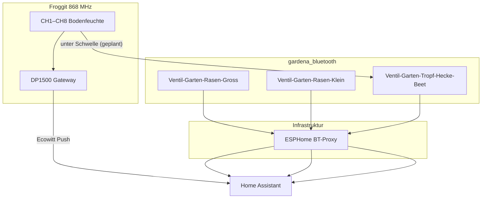

# Garten: Bewässerung (Froggit/Ecowitt-Feuchte + Gardena Bluetooth-Ventile)

Spec für Bodenfeuchte und drei Bewässerungszonen im Garten. Ersetzt die frühere **Gardena Smart System**-Welt (Cloud + Smart Gateway) ohne neuen Hub.

**Verwandt:** [`integrationen-und-addons.md`](./integrationen-und-addons.md) · [`standards.md`](./standards.md) · [`raeume-und-bereiche.md`](./raeume-und-bereiche.md)

---

## Ziel

- **Hecke + Beet + weitere Zonen:** Bodenfeuchte per **Froggit DP100/DP110** (868 MHz) über **DP1500**-Gateway → HA-Integration **Ecowitt**
- **Tropfbewässerung** per **Gardena BT-Ventil** — optional automatisch bei Trockenheit (Beet CH5, 2× täglich)
- **Rasen (2 Zonen):** zwei weitere BT-Ventile — manuell oder später Zeit/Wetter (kein Bodenfeuchte-Sensor am Rasen)
- **Kein Gardena Smart Gateway** — alte `gardena_smart_system`-Geräte aufräumen
- **Zigbee-Bodenfeuchte** (Tuya/ThirdReality): optional parallel — siehe [Abschnitt Zigbee](#zigbee-bodenfeuchte-optional--innen)

---

## Architektur

| Funktion | Hardware | Integration |
|----------|----------|-------------|
| Gateway + 8× Bodenfeuchte | **froggit DP1500** (≈ Ecowitt **GW1100A**) + **DP100** (max. 8 Kanäle) | Core **`ecowitt`** (UI) |
| Zone A — großer Regner | Gardena 1285-20 | `gardena_bluetooth` → `valve.*` |
| Zone B — 2 kleine Regner | Gardena 1285-20 | `gardena_bluetooth` |
| Zone C — Tropf Hecke/Beet | Gardena 1285-20 | `gardena_bluetooth` |
| BLE-Reichweite Garten | **ESPHome Atom am EG-Fenster** (`atom-bluetooth-proxy-eg-garten.yaml`) | ESPHome — **active scanning** |
| BLE sonst | Atom 1.OG / 2.OG (passiv) | [`esphome/atom-bluetooth-proxy-*.yaml`](../esphome/) |

**Abgrenzung:** `gardena_smart_system` (HACS, Cloud) ≠ `gardena_bluetooth` (Core, lokal). **Froggit DP100/DP110** ≠ Zigbee — laufen nur über **DP1500**, nicht über Zigbee2MQTT.

---

## Froggit DP1500 → Home Assistant (Ecowitt)

### Hardware

| Teil | Modell | Hinweis |
|------|--------|---------|
| Gateway | **froggit DP1500** | In HA als **GW1100A** (Firmware z. B. `GW1100A_V2.4.5`); Web-UI **`http://192.168.188.166/`** |
| Bodenfeuchte | **froggit DP100** (868 MHz) | Bis **8 Kanäle** am DP1500; IP66 outdoor |
| App / Web-UI | **WS View Plus** | Pairing der DP100-Kanäle; Live Data zeigt **CH1–CH8** |

Technisch identisch mit **Ecowitt GW1100** — HA-Integration heißt deshalb **Ecowitt**, nicht „Froggit“.

### Einrichtung Home Assistant (Core, UI)

1. **Einstellungen → Geräte & Dienste → Integration hinzufügen → Ecowitt**
2. HA zeigt **Server-IP**, **Pfad** (`/api/webhook/…`) und **Port** (`8123`) — notieren
3. Am **DP1500** den Upload-Server konfigurieren (siehe unten)
4. Nach 1–2 Minuten: Gerät **GW1100A** + Sensoren in HA

**Voraussetzung:** DP1500 muss HA per **HTTP** auf Port **8123** erreichen (kein HTTPS — Ecowitt-Protokoll unterstützt kein TLS).

### Upload-Server am DP1500 konfigurieren

> **Häufiger Stolperstein:** „Others / DIY Upload Servers“ gibt es **nur in der Handy-App**, nicht in der Web-UI-Seitenleiste.

#### Option A — Web-UI (Browser)

**URL:** [`http://192.168.188.166/`](http://192.168.188.166/)

1. Links **Weather Services** wählen (nicht „Live Data“)
2. **Ganz nach unten scrollen** (unter Ecowitt.net, Wunderground, …)
3. Abschnitt **Customized** / **Angepasst**:
   - **Customized:** Enable
   - **Protocol Type Same As:** Ecowitt
   - **Server IP:** LAN-IP von HA (z. B. `192.168.188.99`)
   - **Port:** `8123`
   - **Path:** `/api/webhook/<webhook-id>` — **mit** führendem `/` (Web-UI)
   - **Upload Interval:** z. B. `60` s
4. **Save**

#### Option B — WS View Plus App

1. Gateway wählen → **⋯** → **Others** → **DIY Upload Servers** → **Customized**
2. Protokoll **Ecowitt**, gleiche IP/Port
3. **Path ohne** führenden Slash: `api/webhook/<webhook-id>` (App setzt `/` selbst)
4. Speichern / **Finish** nicht vergessen

#### Alternative ohne Upload-Server

**Ecowitt Local** (HACS, `alexlenk/ecowitt_local`): nur Gateway-IP eintragen — HA **holt** Daten per Polling. Kein Customized-Block nötig.

### Entities in Home Assistant (Stand 2026-06-23)

Gerät: **`GW1100A`** (`device_id` Ecowitt, Integration `ecowitt`).

| Funktion | Gateway-Kanal | HA `entity_id` |
|----------|---------------|----------------|
| Bodenfeuchte 1 | CH1 | `sensor.gw1100a_soil_moisture_1` |
| Bodenfeuchte 2 | CH2 | `sensor.gw1100a_soil_moisture_2` |
| Bodenfeuchte 3 | CH3 | `sensor.gw1100a_soil_moisture_3` |
| Bodenfeuchte 4 | CH4 | `sensor.gw1100a_soil_moisture_4` |
| Bodenfeuchte 5 | CH5 | `sensor.gw1100a_soil_moisture_5` |
| Bodenfeuchte 6 | CH6 | `sensor.gw1100a_soil_moisture_6` |
| Bodenfeuchte 7 | CH7 | `sensor.gw1100a_soil_moisture_7` |
| Bodenfeuchte 8 | CH8 | `sensor.gw1100a_soil_moisture_8` |
| Innen-Temperatur (Gateway-Kabel) | — | `sensor.gw1100a_indoor_temperature` |
| Innen-Luftfeuchte | — | `sensor.gw1100a_indoor_humidity` |
| Luftdruck absolut/relativ | — | `sensor.gw1100a_absolute_pressure`, `sensor.gw1100a_relative_pressure` |

**Kanal → Standort** (Stand 2026-06-24): Zuordnung physisch abgeschlossen — Friendly Names und Areas in HA gesetzt (siehe Tabelle).

| CH | HA Entity | Standort | Pflanze | Bewässerung / Hinweise |
|----|-----------|----------|---------|------------------------|
| 1 | `sensor.gw1100a_soil_moisture_1` | Zimmer Adrian (1.OG) | Glücksfeder (klein) | Nur Topf — **2× Glücksfeder** bei Adrian (CH1 + CH4) |
| 2 | `sensor.gw1100a_soil_moisture_2` | Wohnzimmer (EG) | Elefantenfuß | Nur Topf |
| 3 | `sensor.gw1100a_soil_moisture_3` | Esszimmer (EG) | Strahlenaralie | Nur Topf |
| 4 | `sensor.gw1100a_soil_moisture_4` | Zimmer Adrian (1.OG) | Glücksfeder (groß) | Nur Topf — **2× Glücksfeder** bei Adrian (CH1 + CH4) |
| 5 | `sensor.gw1100a_soil_moisture_5` | Garten Beet | — | Messstelle wird von **großem Regner** (Zone A) **und Tropfschlauch** (Zone C) erreicht; **Messstelle für Tropf-Automation** |
| 6 | `sensor.gw1100a_soil_moisture_6` | Garten Hecke | — | **Tropfschlauch** Zone C (`Ventil-Garten-Tropf-Hecke-Beet`); nur Anzeige/Dashboard |
| 7 | `sensor.gw1100a_soil_moisture_7` | Garten Himbeeren | Himbeeren | Messstelle wird von **großem Regner** und **Tropfschlauch** erreicht |
| 8 | `sensor.gw1100a_soil_moisture_8` | Zimmer David (1.OG) | Glücksbambus | Nur Topf |

**Aufteilung:** CH1–CH4 und CH8 **innen** (Topfpflanzen). CH5–CH7 **Garten** — Sensoren nach **Standort** benannt (Beet, Hecke, Himbeeren); Hinweise „Regner/Tropf erreicht Messstelle“ beschreiben die **Bewässerungsreichweite**, nicht die Pflanze. Tropf-Automation (`garten_tropf_automatisch`) nutzt **nur CH5 (Beet)**.

#### Friendly Names in HA (gesetzt)

Muster laut [`standards.md`](./standards.md): `Typ-Geschoss-Raum[-Detail]` → hier **`Feuchte-{Geschoss}-{Raum}-{Detail}`**. Die `entity_id` (`sensor.gw1100a_soil_moisture_N`) bleibt von Ecowitt vorgegeben — Anzeigename und Area in der Entity Registry gesetzt.

| CH | Friendly Name | Area (HA `area_id`) |
|----|---------------|---------------------|
| 1 | `Feuchte-1OG-Zimmer-Adrian-Gluecksfeder-klein` | `adrian` |
| 2 | `Feuchte-EG-Wohnzimmer-Elefantenfuss` | `wohnzimmer` |
| 3 | `Feuchte-EG-Esszimmer-Strahlenaralie` | `esszimmer` |
| 4 | `Feuchte-1OG-Zimmer-Adrian-Gluecksfeder-gross` | `adrian` |
| 5 | `Feuchte-Garten-Beet` | `garten` |
| 6 | `Feuchte-Garten-Hecke` | `garten` |
| 7 | `Feuchte-Garten-Himbeeren` | `garten` |
| 8 | `Feuchte-1OG-Zimmer-David-Gluecksbambus` | `david` |

Diagnose-Entities `sensor.gw1100a_soil_ad_*` sind standardmäßig deaktiviert — ignorieren.

### Nächste Schritte (nach Einbindung)

- [x] CH1–CH8 physisch zugeordnet (siehe Tabelle oben)
- [x] Friendly Names + Areas in HA gesetzt (Entity Registry)
- [ ] Area **Garten** am Gateway-Gerät
- [x] Dashboard `uebersicht.yaml` + Automation `garten_tropf_automatisch` auf Ecowitt-Entities umgestellt (Beet CH5, 2× täglich)
- [ ] Schwellwerte `input_number.garten_schwellwert_*` nach 1–2 Wochen Beobachtung kalibrieren

---

## Bewässerungszonen

| Zone | Bewässerung | Steuerung | Friendly Name (Ventil) |
|------|-------------|-----------|------------------------|
| **A** | [Gardena Viereckregner OS 140](https://www.bauhaus.info/viereckregner/gardena-sprinklersystem-viereckregner-os-140/p/27135992) — großer Rasen | Manuell / später Zeit-Wetter | `Ventil-Garten-Rasen-Gross` |
| **B** | 2× [Gardena Versenkregner SD80](https://www.globus-baumarkt.de/p/gardena-versenkregner-sd80-0692152303/) — kleiner Rasen | Manuell / später Zeit-Wetter | `Ventil-Garten-Rasen-Klein` |
| **C** | Tropfschläuche Hecke + Beet | Feuchte-Automation + manuell | `Ventil-Garten-Tropf-Hecke-Beet` |

### Ventil-Mapping (Stand 2026-06-14)

| HA-Gerät (Pairing #) | MAC | Zone | Bewässerung | HA `entity_id` (Ventil) |
|----------------------|-----|------|-------------|---------------------------|
| #1 | `CC:B5:4C:AC:75:7B` | A | Viereckregner OS 140 | `valve.ventil_garten_rasen_gross` |
| #2 | `CC:B5:4C:4B:DC:87` | C | Tropf Hecke/Beet *(Leck repariert 2026-07-25)* | `valve.ventil_garten_tropf_hecke_beet` |
| #3 | `CC:B5:4C:AC:72:EE` | B | 2× Versenkregner SD80 | `valve.ventil_garten_rasen_klein` |

Gehäuse am Ventil mit Zone **A / B / C** beschriften (nicht Pairing-# — #2 ist Tropf, nicht „zweiter Regner“).

**Testprotokoll:**

1. Alle Ventile: Batterie raus → Factory Reset ([HA-Doku](https://www.home-assistant.io/integrations/gardena_bluetooth/): Man.-Taste + Batterie ~10 s)
2. Nur **Ventil 1** in HA unter **Einstellungen → Geräte & Dienste → Gardena Bluetooth** hinzufügen
3. In HA **30 s** Service `valve.open_valve` → beobachten welcher Regner/Tropf läuft
4. Gerät umbenennen (Friendly Name laut Tabelle), Area **Garten**
5. Batterie raus am getesteten Ventil; **Ventil 2** pairen → wiederholen
6. Ventil 3 analog; Tabelle oben vervollständigen; Gehäuse beschriften

**Details zum Ablauf:** Abschnitt [Lösung — Erfolgsrezept](#lösung--erfolgsrezept-stand-2026-06) (nRF Connect, Entkoppeln, Custom Integration, LED-Verhalten).

---

## Zigbee-Bodenfeuchte (optional / innen)

> **Garten-Automation V1** nutzt künftig **Froggit/Ecowitt** (oben). Zigbee-Sensoren können parallel für Tests/Innen bleiben.

### Bestand (gekauft)

| Einsatz | Stück | Modell | Z2M |
|---------|-------|--------|-----|
| **Garten** Hecke + Beet | 2× | **Tuya SGS01Z** (TS0601_soil_3, IP67) | [TS0601_soil_3](https://www.zigbee2mqtt.io/devices/TS0601_soil_3.html) |
| **Innen** Topfpflanzen | 3× | **ThirdReality** 3RSM0147Z oder Gen2 3RSM0347Z | [3RSM0147Z](https://www.zigbee2mqtt.io/devices/3RSM0147Z.html) |

**Aufteilung:** Tuya **ungeschützt draußen** (Regen) — IP67. ThirdReality **innen** in Töpfen — kein Wasserschutz nötig, reicht für Raum-/Topf-Einsatz; Werte eher als Trend lesen.

- **Hecke:** Tuya in typischer Tropfzone
- **Beet:** Tuya im Beet
- **Innen:** ThirdReality pro Topfpflanze — `friendly_name` nach Raum/Ort (siehe unten)
- Rasen: **keine** Sensoren (Regner ≠ sinnvolle Messstelle)

### Tuya outdoor — Hinweise

- In Z2M unter **Settings (Specific)** optional `soil_moisture_calibration` / `temperature_calibration`
- **Batterie-%** kann beim Tuya **bis ~24 h** brauchen, bis der erste Wert kommt — normal
- Pairing **am finalen Standort** im Garten (Reichweite!)

### Zigbee-Netzwerk

Aktuell keine Outdoor-Geräte in Z2M — **Reichweite planen:**

1. Zigbee-Router nahe Garten (z. B. Steckdose am EG-Fenster zur Terrasse)
2. Pairing **am finalen Standort**
3. `linkquality` in Zigbee2MQTT beobachten (Ziel: stabil > 100)

### Pairing Garten (Tuya)

1. Z2M: **Permit join** an (`switch.zigbee2mqtt_bridge_permit_join`)
2. Sensor am Standort aktivieren (Batterie)
3. In `zigbee2mqtt/configuration.yaml` unter `devices:` — **`friendly_name` setzen:**
   - `Feuchte-Garten-Hecke`
   - `Feuchte-Garten-Beet`
4. HA: Area **Garten**
5. Nach 1–2 Wochen Schwellwerte in `input_number.garten_schwellwert_*` kalibrieren (Trend wichtiger als absolute %)

### Pairing innen (ThirdReality)

1. **In der Nähe eines Zigbee-Routers** pairen (Wohnbereich — kein Outdoor-Router nötig)
2. **`friendly_name`** nach Raum/Ort, z. B.:
   - `Feuchte-EG-Wohnzimmer-Pflanze` (Platzhalter — beim Einbau anpassen)
   - weitere nach Bedarf
3. HA: passende **Area** (nicht Garten)
4. **Keine** Anbindung an Garten-Automationen in V1 — nur Dashboard/Anzeige optional später

### Erwartete Entities Garten (Z2M → HA, **optional — nicht gepairt**)

**Produktiv:** Froggit/Ecowitt `sensor.gw1100a_soil_moisture_5` (Beet) und `_6` (Hecke). Die Zigbee-Tuya-Sensoren sind Backlog.

| Z2M friendly_name | HA entity_id (nach Pairing, Beispiel-Muster) |
|-------------------|---------------------------------------------|
| Feuchte-Garten-Hecke | sensor.&lt;slug&gt;_soil_moisture, _temperature, _battery |
| Feuchte-Garten-Beet | sensor.&lt;slug&gt;_soil_moisture, _temperature, _battery |

Abweichende IDs nach Pairing in dieser Tabelle nachtragen.

### Erwartete Entities innen (ThirdReality, Beispiel, **optional**)

| Z2M friendly_name (Beispiel) | HA entity_id (nach Pairing, Beispiel-Muster) |
|------------------------------|---------------------------------------------|
| Feuchte-EG-Wohnzimmer-Pflanze | sensor.&lt;slug&gt;_soil_moisture, … |

Namen beim Pairing festlegen; **keine feste YAML-Abhängigkeit** in V1.

---

## Gardena Bluetooth-Ventile

- Modell: **Bewässerungsventil 9 V Bluetooth (1285-20)**
- Firmware: **≥ 1.7.23.29** (Update ggf. einmalig über Gardena Bluetooth App vor Factory Reset)
- Integration: **Gardena Bluetooth** (Core, nicht HACS)
- Entity-Typ: **`valve`** — Services `valve.open_valve` / `valve.close_valve` (Skripte im Repo)

### BLE-Infrastruktur

| Proxy | Datei | Modus | Standort |
|-------|-------|-------|----------|
| **EG Garten** | `esphome/atom-bluetooth-proxy-eg-garten.yaml` | **active scanning** (Pairing + Ventile) | EG-Fenster zum Garten (seit 06/2026) |
| 1. OG | `esphome/atom-bluetooth-proxy-2-1og.yaml` | passiv | 1. OG |
| 2. OG | `esphome/atom-bluetooth-proxy-3-2og.yaml` | passiv | 2. OG |

HA-Anzeigename EG-Proxy: **Bluetooth Proxy EG Garten** (`friendly_name`). ESPHome-Hostname bleibt `atom-bluetooth-proxy-1-keller` (OTA-Stabilität).

**OTA nach YAML-Änderung:** Add-on **ESPHome Device Builder** → `atom-bluetooth-proxy-eg-garten.yaml` → **Install** (Over-The-Air). Grund: Active/Passive-Scanning liegt in der **ESP-Firmware**, nicht in HA.

Bei Verbindungsproblemen nur am **EG-Proxy** active lassen; 1.OG/2.OG können passiv bleiben.

### Lösung — Erfolgsrezept (Stand 2026-06)

So sind die **3× Gardena 1285-20** zuverlässig in Home Assistant gelandet. Reihenfolge und Entkopplung waren entscheidend — nicht nur Factory Reset.

#### Kurzfassung

| Baustein | Was wir nutzen |
|----------|----------------|
| BLE-Reichweite Garten | ESPHome **Atom EG-Fenster**, **Active Scanning** (YAML + HA-UI) |
| Integration in HA | **`custom_components/gardena_bluetooth/`** — Anzeige **„Gardena Bluetooth (Proxy Fix)“** (Workaround bis Core-Patch merged) |
| Diagnose am Ventil | **nRF Connect** auf dem Handy (Nordic Semiconductor, nicht „NFC“) |
| Steuerung | Service `valve.open_valve` / `valve.close_valve` — Skripte und Dashboard im Repo |
| Gardena-App danach | **Nicht parallel** — sonst sperrt die App HA aus dem BT-Pairing |

#### Einmalige Vorbereitung

1. **Firmware** am Ventil ≥ **1.7.23.29** (falls nötig: einmalig über **Gardena Bluetooth App** updaten, *bevor* alles für HA entkoppelt wird).
2. **ESPHome BT-Proxy EG:** `active: true` in [`atom-bluetooth-proxy-eg-garten.yaml`](../esphome/atom-bluetooth-proxy-eg-garten.yaml) → **OTA flashen** (Add-on ESPHome Device Builder).
3. **HA-UI:** Gerät **Bluetooth Proxy EG Garten** → Konfigurieren → **Bluetooth-Scanmodus: Active** (YAML allein reicht nicht immer).
4. **Custom Integration** im Repo belassen — Core-Integration allein scheitert oft mit *Unable to find product type* über ESPHome-Proxies (siehe unten).

#### Pro Ventil — Ablauf (der funktioniert hat)

1. **Alte Kopplungen entfernen**
   - War das Ventil in der **Gardena Bluetooth App** (oder am Handy) gekoppelt: dort **Gerät löschen / entkoppeln**.
   - **nRF Connect:** Ventil in der Geräteliste öffnen → falls **Connected** oder alte Bonding-Einträge: **Disconnect** / Verbindung trennen. Ohne diesen Schritt blieb Pairing in HA oft hängen oder scheiterte still.
2. **Factory Reset** ([HA-Doku](https://www.home-assistant.io/integrations/gardena_bluetooth/)): Man.-Taste halten → 9-V-Block einlegen → **~10 s** weiter halten → **blaue LED blinkt ~3 Min** (Pairing-Fenster).
3. **nRF Connect — Sichtbarkeit prüfen** (Ventil **< 2 m** vom EG-Proxy und Handy):
   - Gerät erscheint (Name/MAC, Service `98BD…`) → Ventil sendet; weiter mit HA.
   - Nichts sichtbar → Reset-Fenster abgelaufen, Batterie prüfen, Wähler **AUTO** (nicht OFF), Steuerteil auf Ventil.
4. **In HA hinzufügen:** **Einstellungen → Geräte & Dienste → Gardena Bluetooth (Proxy Fix) → Gerät hinzufügen** — **nur ein Ventil** gleichzeitig.
5. **Zone zuordnen:** Service `valve.open_valve` **30 s** → beobachten welcher Regner/Tropf läuft → Friendly Name + Area **Garten** (Tabelle [Ventil-Mapping](#ventil-mapping-stand-2026-06-14)).
6. **Batterie raus** am getesteten Ventil → nächstes Ventil ab Schritt 1.

Ventile **nicht parallel** in der Gardena-App behalten — App kann HA aus dem BT-Pairing sperren.

#### nRF Connect — warum so hilfreich

- [Android](https://play.google.com/store/apps/details?id=no.nordicsemi.android.mcp) / [iOS](https://apps.apple.com/app/nrf-connect/id1051074755)
- Zeigt **alle** BLE-Geräte — unabhängig von HA und Gardena-App.
- **Werbung sichtbar?** Unterscheidet „Ventil tot“ vs. „HA/Proxy-Konfiguration“.
- **Entkoppeln:** Alte Handy-/App-Verbindung **vor** HA-Pairing trennen — in der Praxis oft der entscheidende Schritt.
- **Scan Response:** nRF (aktiv) sieht oft **Advertising + Scan Response**; ESPHome-Proxies leiten teils nur Advertising weiter → Grund für den Proxy-Fix (Herstellerdaten / Produkttyp).

#### Custom Integration — wann und warum

**Symptom:** Pairing startet, danach *Einrichtungsfehler: Unable to find product type*.

**Ursache:** Gardena sendet Service-UUID `98BD…` im Advertising; Herstellerdaten `0x0426` (Produkttyp) oft erst in der **Scan Response**. ESPHome-Proxies geben das nicht zuverlässig an HA weiter.

**Workaround (Repo):** `custom_components/gardena_bluetooth/` — akkumuliert Werbung über Scan-Service, **BLE-Connect-Fallback** für Produkttyp. Upstream-Patch vorbereitet: [`upstream-pr-gardena-bluetooth.md`](upstream-pr-gardena-bluetooth.md).

#### Normalbetrieb — **keine Bluetooth-LED** ist ok

Nach erfolgreichem HA-Pairing leuchten die Ventile **dauerhaft ohne blaue Verbindungs-LED** — das ist **normal** und kein Fehler.

- Steuerung läuft über den **ESPHome BT-Proxy** und HA, nicht über sichtbares „BT-Pairing“ am Gerät.
- **Nicht** erneut Factory Reset nur wegen fehlender LED — sonst Mapping und HA-Einträge verlieren.
- Kurztest: Service `valve.open_valve` / Dashboard — Ventil reagiert → alles in Ordnung.

#### Ventil in HA „an“, aber physisch nichts passiert

| Prüfung | Hinweis |
|---------|---------|
| Richtige **Entity** nach Zone-Mapping | z. B. `valve.ventil_garten_rasen_gross`, nicht Pairing-Reihenfolge raten |
| **`manuelle_bewasserungszeit`** | Muss **> 0** sein (Ventil-Entity in HA) — bei 0 öffnet nichts |
| **Wähler am Ventil** | **AUTO**, nicht OFF |
| **9-V-Alkaliblock** | Frisch, Steuerteil korrekt auf Ventil |
| **Zone C Tropf** | Seit 2026-07-25 wieder freigegeben (Leck repariert) |

#### Wenn gar nichts geht

- Batterie **30 Min raus** (Entladung), **ein** Reset, sofort im Pairing-Fenster testen — nicht fünfmal hintereinander resetten.
- nRF Connect: weiterhin unsichtbar → Hardware/Reset; sichtbar, HA nicht → Proxy Active + Custom Integration prüfen.

### Entities (Ventile)

| Friendly Name | entity_id | Bild (Dashboard) |
|---------------|-----------|------------------|
| `Ventil-Garten-Rasen-Gross` | `valve.ventil_garten_rasen_gross` | Icon `mdi:sprinkler` *(Produktfoto OS 140 optional nach `/config/www/images/garden/`)* |
| `Ventil-Garten-Rasen-Klein` | `valve.ventil_garten_rasen_klein` | `/local/images/garden/regner-sd80.webp` |
| `Ventil-Garten-Tropf-Hecke-Beet` | `valve.ventil_garten_tropf_hecke_beet` | Icon `mdi:water` |

---

## YAML (Repo)

| Datei | Inhalt |
|-------|--------|
| `helpers.yaml` | Schwellwerte, Tropf-Dauer Morgen/Tag, Sperre, Max-Läufe/Tag, `counter.garten_tropf_laeufe_heute`, Auto-Schalter |
| `scripts.yaml` | `garten_tropf_bewaessern` (Limits), `garten_tropf_limit_alarm`, `garten_morgen_bewaessern`, … |
| `automations.yaml` | `garten_rasen_morgens`, `garten_tropf_automatisch` (Tag+Abend), `garten_tropf_zaehler_reset`, Max-Laufzeit |
| `dashboards/uebersicht.yaml` | Karten Garten (Feuchte, Ventile, Auto-Schalter) |
| `dashboards/garten.yaml` | **Eigenes Dashboard** Bewässerung + 8× Feuchte mit Pflanzenbildern — [`dashboard-garten.md`](./dashboard-garten.md) |
| `docs/sprachsteuerung-garten.md` | Google Assistant / Assist — An/Aus + Aliase |
| `google_assistant_expose.yaml` | Freigabe-Liste für Google Assistant (Git) |

### Ventil-Services (HA)

Skripte und Automationen nutzen `valve.open_valve` / `valve.close_valve` (nicht `valve.open` / `valve.close`).

### Sicherheit Max-Laufzeit (V1)

- Helper: `input_number.garten_max_laufzeit_stunden` (Standard **1 h**, konfigurierbar)
- Automation `garten_sicherheit_max_laufzeit`: prüft alle **5 Min** und bei Ventil-Öffnung, ob ein Außen-Ventil länger als die Max-Laufzeit **offen** ist → `valve.close_valve` + Hinweis-Benachrichtigung
- Gilt für alle drei Ventile: Rasen groß/klein, Tropf Hecke/Beet

### Logik Morgen (04:00) — feuchtebasiert

Schalter: `input_boolean.garten_rasen_automatisch` (**an** = Morgenprogramm aktiv).

Automation `garten_rasen_morgens` → `script.garten_morgen_bewaessern` — **jede Zone nur bei Bedarf** (Sensor unter Schwellwert; Sensor fehlt/unavailable → Zone überspringen):

| Schritt | Zone | Sensor | Schwellwert-Helper | Dauer |
|---------|------|--------|--------------------|-------|
| 1 | A Viereckregner | CH7 Himbeeren (`sensor.gw1100a_soil_moisture_7`) | `input_number.garten_schwellwert_himbeeren` | `garten_rasen_dauer_minuten` |
| 2 | B Versenkregner | wie Zone A (kein eigener Rasen-Sensor) | gleicher Schwellwert | gleiche Dauer |
| 3 | C Tropf | CH5 Beet **oder** CH6 Hecke unter Schwellwert | `garten_schwellwert_beet` / `_hecke` | `garten_tropf_dauer_minuten` (**45 Min**) |

Nacheinander (kein Parallelbetrieb). Ist alles feucht genug → Skript endet ohne Ventilöffnung.

**Hinweis Rasen:** Es gibt keinen Sensor direkt im Rasen — CH7 (Himbeeren, vom großen Regner mit erreicht) ist der Proxy für Zone A/B. Nach Kalibrierung Schwellwert anpassen.

### Logik Tropf (Zone C) — jederzeit bei Trockenheit, mit Limits

Schalter: `input_boolean.garten_tropf_automatisch` (**an** = Tages- und Abend-Tropf aktiv).

| Auslöser | Wann | Dauer |
|----------|------|-------|
| Morgenprogramm | 04:00, wenn Beet/Hecke trocken (über `garten_rasen_automatisch`) | `garten_tropf_dauer_minuten` (**45 Min**) |
| Tagsüber Feuchte | CH5 oder CH6 unter Schwellwert für **15 Min**, nur **08:00–20:00** | `garten_tropf_dauer_tag_minuten` (**30 Min**) |
| Abends | 21:00, wenn Beet/Hecke trocken | wie Morgen (45 Min) |

**Sicherheit / Limits (verhindert Dauerlauf und zu häufiges Gießen):**

| Limit | Helper / Mechanik | Reaktion |
|-------|-------------------|----------|
| Max. offen | `garten_max_laufzeit_stunden` (1 h) | Ventil zu + Benachrichtigung |
| Mindestabstand | `garten_tropf_sperre_stunden` (**4 h**) | neuer Lauf wird übersprungen |
| Max. Läufe / Tag | `garten_tropf_max_laeufe_tag` (**3**) + `counter.garten_tropf_laeufe_heute` | **kein** neuer Lauf; Auto-Schalter **aus**; Push + persistente Meldung → manuell nachschauen |
| Zähler-Reset | Mitternacht | `counter.reset` |

Skript `garten_tropf_bewaessern` prüft Tageslimit vor dem Öffnen; optional `dauer_minuten` als Feld (Tagsüber 30).

### Topf-Anzeige (Dashboard, keine Auto-Bewässerung)

| Pflanze | CH | Orange (giessen?) unter |
|---------|----|-------------------------|
| Glücksfeder, Strahlenaralie, Glücksbambus | 1,3,4,8 | **35 %** fest |
| **Elefantenfuß** (trockenheitsliebend) | 2 | `input_number.topf_schwellwert_elefantenfuss` (**20 %**) |

> **Stand 2026-07-25:** Morgen feuchtebasiert; Tropf tagsüber 30 Min bei Trockenheit; Tageslimit 3 + Sperre 4 h + Max-offen 1 h.

Garten-Schwellwerte Start: Beet/Hecke/Himbeeren **35 %** — nach Beobachtung kalibrieren.

---

## Alte Gardena Cloud aufräumen (UI)

**Nur in der HA-UI** (kein `.storage`-Edit durch Agent):

1. **Einstellungen → Geräte & Dienste → Gardena Smart System**
2. Prüfen: nur noch tote Sensoren / disabled Water Controls?
3. Integration **Entfernen** (oder einzelne Geräte löschen)
4. Betroffene Legacy-Entities verschwinden, u. a.:
   - `sensor.feuchtesensor_garten_soil_humidity`
   - `sensor.feuchte_hecke_soil_humidity`
   - `sensor.feuchte_beet_soil_humidity`
   - `switch.wassersteuerung` (disabled)
5. Physische **GARDENA smart Sensor** ohne Gateway: entsorgen/verkaufen

HACS-Repo `gardena_smart_system` optional deinstallieren, wenn nicht mehr benötigt.

---

## Abnahme-Checkliste

- [x] **DP1500** in HA (Ecowitt), 8× `soil_moisture` + Gateway-Werte live
- [x] CH1–CH8 Standorte dokumentiert (Kanal-Tabelle)
- [x] Friendly Names + Areas in HA gesetzt (8× `soil_moisture`)
- [x] Dashboard/Automation auf Ecowitt-Entities umgestellt (Beet CH5, 2× täglich 04:00+21:00)
- [ ] 2× **Tuya** Garten (optional): Feuchte + Temperatur + Batterie, `linkquality` ok
- [ ] 3× **ThirdReality** innen: Werte plausibel, Areas gesetzt
- [x] 3× BT-Ventile: Mapping-Tabelle ausgefüllt, alle per HA schaltbar
- [ ] Tropf-Ventil: manuell + Automation (Auto-Schalter testweise an)
- [ ] Rasen-Ventile: manuelle Skripte testen
- [ ] `gardena_smart_system` entfernt / aufgeräumt
- [ ] Schwellwerte nach 1–2 Wochen kalibriert

---

## Backlog (nicht V1)

- **Upstream Core-PR:** Gardena Bluetooth Produkttyp über ESPHome-Proxies — Patch vorbereitet, PR noch nicht eingereicht → [`upstream-pr-gardena-bluetooth.md`](upstream-pr-gardena-bluetooth.md). Nach Merge: Custom Integration entfernen, Core wieder nutzen.
- Rasen-Zonen A/B: Zeitplan oder Wetter-Integration (Regen-Vorhersage)
- Push bei leerer Ventil-Batterie
- Separater Zigbee-Router outdoor dokumentieren in `hardware.md` nach Kauf
