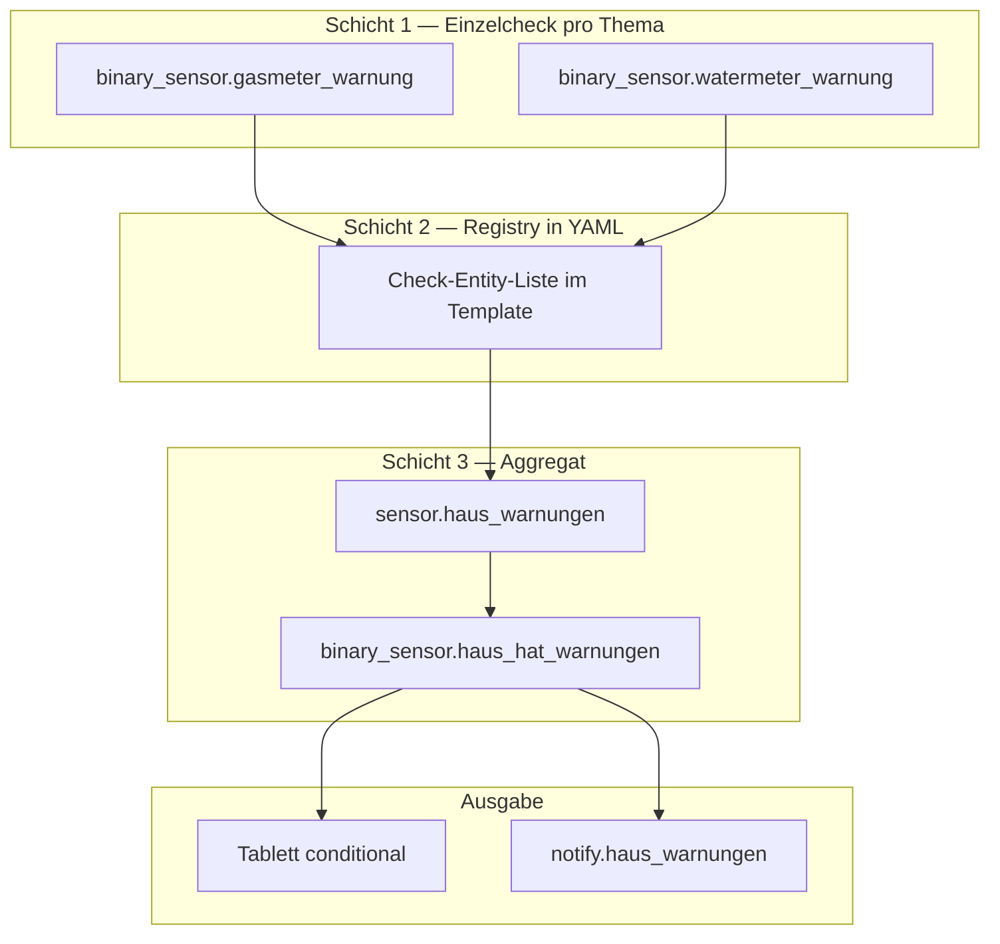

# Haus-Warnungen: Monitoring, Tablett-UI, Push

Zentrales System, um **technische Probleme im Haus** automatisch zu erkennen, auf dem **Küchen-Tablett nur bei Bedarf** anzuzeigen und per **Handy-Push** zu melden.

**Phase 1 (Gas/Wasser-Zähler):** umgesetzt seit 2026-06-07 — `binary_sensor.*_warnung`, Aggregat, Tablett, Push.  
**Architektur gilt dauerhaft:** Neue Checks in der Template-Liste `sensor.haus_warnungen` (configuration.yaml) + [Registry-Tabelle](#registry-überwachte-checks) pflegen.

> **HA 2026:** Old-style `group:` wird nicht mehr zuverlässig geladen. Statt einer separaten Gruppe `haus_warnungen_checks` nutzen wir eine explizite Entity-Liste im Template (zwei Stellen: `state` + `liste`).

## Ziel

- Kritische Sensoren liefern zuverlässig Werte — sonst Alarm
- **Dezent im Hintergrund:** Tablett bleibt clean, wenn alles ok ist
- **Eine Quelle der Wahrheit** für UI und Push (`sensor.haus_warnungen`)
- Erweiterbar ohne Dashboard-/Automation-Listen neu zu pflegen

**Nicht in diesem System (Phase 1):** Informations-Pushes (Waschmaschine fertig, Müll morgen, …). Bestehende Einzel-Automationen (Nuki, Befeuchter, Radon, …) bleiben vorerst separat.

---

## Architektur (3 Schichten)

Nichts ist manuell abzuhaken. Kein `input_boolean`, keine Checkbox. Alles wird aus Live-States berechnet und geht automatisch wieder auf `off`.



| Schicht | Entity | Aufgabe |
|---------|--------|---------|
| 1 | `binary_sensor.*_warnung` | Eine Prüflogik pro Thema + Attribut `grund` |
| 2 | Check-Entity-Liste in `configuration.yaml` | **Registry** — neue Checks in Template-Liste eintragen |
| 3 | `sensor.haus_warnungen` | Anzahl + Attribut `liste` (Texte für UI/Push) |
| 3 | `binary_sensor.haus_hat_warnungen` | `on` wenn Anzahl > 0 — nur Schalter, kein eigener Check |

Muster für die Liste: [`sensor.batterie_ubersicht`](../configuration.yaml) (State = Zahl, Details im Attribut).

---

## Erweiterungsregel (verbindlich)

**Neuer Test = Eintrag in Template-Liste + Registry-Tabelle unten.**

UI (Tablett), Aggregat und Push-Automation lesen `sensor.haus_warnungen` — **keine separaten Listen** in Dashboard oder Automation pflegen.

### Checkliste: neuen Check hinzufügen

1. **Diese Spec:** Zeile in [Registry](#registry-überwachte-checks) unten
2. **YAML:** `binary_sensor.<name>_warnung` mit Logik + Attribut `grund`
3. **YAML:** Entity in Template-Liste (`sensor.haus_warnungen`) eintragen
4. **Abnahme:** Check künstlich triggern → Gruppe, Aggregat, Tablett, Push prüfen

---

## Registry: überwachte Checks

| ID | Check-Entity | Quellen | `on` wenn | Push | UI |
|----|--------------|---------|-----------|------|-----|
| gasmeter | `binary_sensor.gasmeter_warnung` | `sensor.gasmeter_uptime`, `sensor.gasmeter_value`, `sensor.gasmeter_error`, `binary_sensor.gasmeter_problem` | kein MQTT-Lebenszeichen, Gerätefehler | ja | Tablett |
| watermeter | `binary_sensor.watermeter_warnung` | `sensor.watermeter_uptime`, `sensor.watermeter_value`, … | kein MQTT-Lebenszeichen, Gerätefehler | ja | Tablett |
| befeuchter | `binary_sensor.befeuchter_nicht_erreichbar` | `humidifier.deerma_*` | Saison aktiv **und** mindestens ein Befeuchter `unavailable`/`unknown` | ja | Tablett |

**Gas und Wasser:** beide Checks dauerhaft aktiv (seit 2026-06-07 wieder für Wasser — zuvor temporär per Helper abgeschaltet).

**Befeuchter:** nur in der Heizsaison (`input_boolean.befeuchter_saison_aktiv`) — siehe [`befeuchter-saison.md`](./befeuchter-saison.md).

### Fehlerarten pro Zähler (Schicht 1)

| Art | Bedingung |
|-----|-----------|
| **Boot-Toleranz** | Erste **5 Min** nach HA-Neustart: keine Warnung |
| **Kein Lebenszeichen** | `sensor.*_uptime` (Fallback: `*_value`) — `last_updated` älter als `input_number.zaehler_stale_minuten` (Start **45**) |
| **Gerätefehler (anhaltend)** | `binary_sensor.*_problem` = `on` **oder** `sensor.*_error` ≠ `no error` — jeweils nur wenn der Zustand **ununterbrochen** ≥ `input_number.zaehler_fehler_minuten` (Start **30**) und Lebenszeichen ok |

**Hintergrund (2026-06-09):** AI-on-the-Edge sendet **Uptime/Status** regelmäßig per MQTT, den **Zählerstand** (`*_value`) aber nur bei neuer Erkennung. Stale-Check auf `*_value.last_updated` erzeugte Fehlalarme („keine Werte seit 94 Min“), obwohl das Gerät online war.

**Hintergrund (2026-06-10):** OCR-Ausreißer (z. B. einmalig `09985.40N`) setzen `*_problem` kurz auf `on` und springen nach dem nächsten Zyklus zurück. Dauer-Check über `last_changed` — flatternde Fehler lösen **keine** Warnung/Push aus.

Attribut **`grund`** (Beispiele): `Gaszähler: kein MQTT-Lebenszeichen seit 52 Min`, `Wasserzähler: Geräteproblem seit 35 Min`, `Gaszähler: Neg. Rate …` (nur bei anhaltendem Fehlertext).

Geräte-Web-UI: [`ai-on-the-edge.md`](./ai-on-the-edge.md) (Wasser `.121`, Gas `.122`).

### Stale & Zeit-Trigger

Stale hängt an der **Uhr**, nicht an MQTT-Events. Der Aggregat-Block (Schicht 3) braucht deshalb:

- State-Trigger auf Gruppen-Mitglieder und Quell-Entities
- **`time_pattern` alle 5 Minuten** — sonst wird „45 Min ohne Werte“ erst beim nächsten Zufalls-Update sichtbar

---

## Entities

| Entity | Typ | Rolle |
|--------|-----|--------|
| `input_number.zaehler_stale_minuten` | helper | Schwellwert Stale (45 min, 15–180) |
| `input_number.zaehler_fehler_minuten` | helper | OCR/Problem erst warnen ab Dauer (30 min, 10–120) |
| `binary_sensor.gasmeter_warnung` | template | Einzelcheck Gas |
| `binary_sensor.watermeter_warnung` | template | Einzelcheck Wasser |
| `sensor.haus_warnungen` | trigger template | Anzahl + Attribut `liste` (enthält Check-Registry) |
| `binary_sensor.haus_hat_warnungen` | template | abgeleitet aus Anzahl > 0 |
| `notify.haus_warnungen` | notify group | Push — Start: `mobile_app_pixel_9_pro` |

---

## Verhalten

### Normalbetrieb

- Alle `binary_sensor.*_warnung` = `off`
- `binary_sensor.haus_hat_warnungen` = `off` → **keine Karte** auf dem Tablett
- Kein Push

### Problem

- Mindestens ein Check = `on` → `sensor.haus_warnungen` baut `liste`
- `binary_sensor.haus_hat_warnungen` = `on`
- Tablett: conditional Mushroom-Karte oben (rot, mehrzeilig)
- Automation **`System: Haus-Warnungen benachrichtigen`**: Push an `notify.haus_warnungen`

### Push-Spam vermeiden

- Automation **`mode: single`**, Trigger `for: 00:05:00` auf `haus_hat_warnungen`
- Zähler: transient OCR/`problem`-Flattern wird in Schicht 1 durch **`zaehler_fehler_minuten`** gefiltert (kein `on` bei Einzelzyklus-Fehler)

### Randfälle

- **HA-Neustart:** Aggregat nach Start neu berechnen (`homeassistant` start-Trigger)
- **Problem behoben:** Check geht auf `off` → Aggregat leer → Tablett-Karte verschwindet
- **„Problem behoben“-Push:** Backlog, Phase 1 nicht zwingend

---

## UI — Tablett ([`dashboards/tablett.yaml`](../dashboards/tablett.yaml))

Oben im `vertical-stack`, **vor** den Licht-Szenen — nur sichtbar wenn `binary_sensor.haus_hat_warnungen` = `on`:

```yaml
type: conditional
conditions:
  - entity: binary_sensor.haus_hat_warnungen
    state: "on"
card:
  type: custom:mushroom-template-card
  primary: "Achtung"
  secondary: "{{ state_attr('sensor.haus_warnungen', 'liste') }}"
  multiline_secondary: true
  icon: mdi:alert-circle
  icon_color: red
  layout: vertical
```

Siehe auch [`dashboard-tablett.md`](./dashboard-tablett.md).

---

## Push — Notify-Gruppe

```yaml
notify:
  - platform: group
    name: haus_warnungen
    services:
      - service: mobile_app_pixel_9_pro
```

Weitere Handys: nur in der Gruppe ergänzen, Automation unverändert lassen.

---

## YAML-Dateien (Implementierung)

| Datei | Inhalt |
|-------|--------|
| [`helpers.yaml`](../helpers.yaml) | `input_number.zaehler_stale_minuten` |
| [`configuration.yaml`](../configuration.yaml) | Schicht 1–3 Templates, `notify` |
| [`automations.yaml`](../automations.yaml) | `System: Haus-Warnungen benachrichtigen` |
| [`dashboards/tablett.yaml`](../dashboards/tablett.yaml) | conditional Warn-Block |

**Status:** umgesetzt (YAML in Repo). Nach Reload/Core-Neustart in HA testen.

---

## Abnahme-Checkliste

- [ ] `input_number.zaehler_stale_minuten` = 45
- [ ] Gas/Wasser ok → alle `*_warnung` = `off`, Tablett ohne Warn-Karte
- [ ] Wasser offline simulieren → `watermeter_warnung` = `on`, `grund` plausibel
- [ ] Stale: kein Update > 45 Min → Warnung (nach 5-Min-Tick)
- [ ] `sensor.haus_warnungen.liste` enthält Klartext
- [ ] Tablett: rote Karte nur bei Problem
- [ ] Push auf Pixel 9 Pro via `notify.haus_warnungen`
- [ ] Recovery: Problem weg → Karte weg, kein Dauer-Push

---

## Backlog

- [ ] Weitere Checks in Registry + Template-Liste (Nuki kritisch, Befeuchter leer, …)
- [ ] Optional: gleiche Warn-Karte auf [`dashboard-uebersicht.md`](./dashboard-uebersicht.md)
- [ ] Push „Problem behoben“
- [ ] Bestehende Einzel-Push-Automationen schrittweise in Schicht 1 überführen (optional)

---

## Siehe auch

- [`ai-on-the-edge.md`](./ai-on-the-edge.md) — Zähler-Hardware, MQTT, Web-UI
- [`dashboard-tablett.md`](./dashboard-tablett.md) — Küchen-Tablet
- [`dashboard-batterie.md`](./dashboard-batterie.md) — ähnliches Aggregat-Muster
- [`standards.md`](./standards.md) — Naming, Mushroom/Glue
