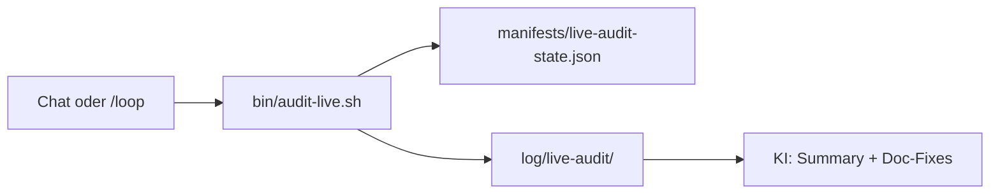

# Live-Audit: Repo ↔ Home Assistant

Systematischer Abgleich zwischen **Dokumentation**, **YAML im Git-Repo** und der **laufenden Home-Assistant-Instanz**. Ergänzt die Änderungs-Checkliste [`abgleich-checkliste.md`](./abgleich-checkliste.md) und den Skill `ha-abgleich` (bei Implementierung).

## Ziel

- Specs und Live-System **1:1** halten (Entity-IDs, Automationen, Integrationen)
- Probleme früh finden (`unavailable`, deaktivierte Automationen, Log-Fehler)
- Als **Langläufer** über mehrere Sessions oder Cursor-`/loop`-Ticks fortsetzbar

## Abgrenzung

| Situation | Werkzeug |
|-----------|----------|
| Feature implementieren / PR review | Skill `ha-abgleich` + [`abgleich-checkliste.md`](./abgleich-checkliste.md) |
| Periodischer Vollabgleich Docs ↔ Live | Skill **`ha-live-audit`** + `bin/audit-live.sh` |
| Wiederkehrender Modul-Tick | `/loop 1d ha-live-audit --resume` |

**YAML:** Der Audit **ändert kein YAML**. Doc-Fixes sind erlaubt; YAML nur auf expliziten Auftrag.

---

## Architektur



### Check-Tiers (pro Modul)

| Tier | Dauer | Inhalt |
|------|-------|--------|
| **T0** | ~30 s | `ha core check`; HA-Logs ERROR/WARNING; deaktivierte Config-Entries |
| **T1** | ~2–5 min | Entity-IDs aus Spec + YAML → Registry + Live-State |
| **T2** | optional | Domain-Skripte (Energie, HACS-Export) |

T2 läuft, wenn das Modul ein `tier2_script` hat oder T1 `warn`/`fail` meldet.

### Session-Budget

- Standard: **1 Modul** pro Aufruf
- `--quick`: T0 + T1 ohne T2
- `--resume`: nächstes `pending`-Modul aus dem State-Manifest
- **Nightly:** `bin/audit-live-nightly.sh` — alle 12 Module (Standard: `--quick`)

---

## Automatisierung (täglich abends)

| Komponente | Aufgabe |
|------------|---------|
| **Cron 22:00** | `bin/audit-live-nightly.sh` — mechanischer Voll-Lauf, Summary in `log/live-audit/nightly-latest.md` |
| **Cursor Automation** | Eigenständiger Agent-Thread: Report lesen, zusammenfassen, Doc-Fixes bei klaren Abweichungen |

**Cron installieren** (einmalig, auf dem HA-Host):

```bash
bin/install-audit-nightly-cron.sh
```

Log: `log/live-audit-nightly.log` · neueste Summary: `log/live-audit/nightly-latest.md`

**Cursor Automation** (eigener Thread): In Cursor **Automations** → Schedule 22:00 Europe/Berlin → [Vorlage öffnen](https://cursor.com/automations/new?prefill=eyJuYW1lIjoiSEEgTGl2ZS1BdWRpdCAoYWJlbmRzKSIsImRlc2NyaXB0aW9uIjoiVMOkZ2xpY2hlciBWb2xsYWJnbGVpY2ggYWxsZXIgMTIgSEEtTW9kdWxlIiwid29ya2Zsb3ciOnsiYWN0aW9ucyI6W3siaW5zdHJ1Y3Rpb25zIjoiTGFkZSBTa2lsbCBoYS1saXZlLWF1ZGl0LiBGw7xocmUgYmluL2F1ZGl0LWxpdmUtbmlnaHRseS5zaCBhdXMgb2RlciBsaWVzIGxvZy9saXZlLWF1ZGl0L25pZ2h0bHktbGF0ZXN0Lm1kLiBGYXNzZSBhbGxlIDEyIE1vZHVsZSB6dXNhbW1lbi4gRG9jLUZpeGVzIGJlaSBmYWlsL3dhcm4gd2VubiBrbGFyLiBLZWluIFlBTUwgb2huZSBBdGZ0cmFnLiIsInR5cGUiOiJhZ2VudCJ9XSwiZ2l0Q29uZmlnIjp7ImVuYWJsZWQiOnRydWV9LCJtZW1vcnlFbmFibGVkIjpmYWxzZSwidHJpZ2dlcnMiOlt7ImNyb24iOiIwIDIyICogKiAqIiwidGltZXpvbmUiOiJFdXJvcGUvQmVybGluIiwidHlwZSI6InNjaGVkdWxlIn1dfX0) → speichern.

Alternative im Chat: `/loop 1d ha-live-audit --resume` (1 Modul/Tag, Langläufer).

## Module

Definitionen: [`manifests/live-audit-modules.json`](../manifests/live-audit-modules.json) (Quelle; optional spiegelnd in `.yaml`)

| Modul-ID | Spec(s) | YAML / Pfade |
|----------|---------|--------------|
| `core` | `standards.md`, `konfigurations-strategie.md` | `configuration.yaml`, `automations.yaml` |
| `haushalt` | `haushalt-*.md` | `helpers.yaml`, `automations.yaml` |
| `garten` | `garten-bewaesserung.md`, `dashboard-garten.md` | `automations.yaml`, `dashboards/garten.yaml` |
| `climate` | `climate.md`, `dashboard-luftung.md` | `luftung_templates.yaml`, `automations.yaml` |
| `energie` | `energie-*.md` | `configuration.yaml` (Templates) |
| `monitoring` | `haus-warnungen.md` | `configuration.yaml`, `automations.yaml` |
| `zaehler` | `ai-on-the-edge.md` | Templates, `scripts.yaml` |
| `dashboards` | `dashboard-*.md` | `dashboards/*.yaml` |
| `integrations` | `integrationen-und-addons.md`, `hacs-inventar.md` | — |
| `hardware` | `hardware.md`, `raeume-und-bereiche.md` | `.storage` (nur lesen) |
| `lights` | `lights.md` | `scenes.yaml`, `configuration.yaml` (customize/Powercalc/Assist-Skripte; Wasserzähler-Refs = Scope-Leak → `known_issues`) |
| `sprache` | `sprachsteuerung-*.md` | `google_assistant_expose.yaml` |

Neues Feature → Eintrag in `live-audit-modules.json` ergänzen.

---

## Bedienung

```bash
# Ein Modul
bin/audit-live.sh --module haushalt

# Nächstes offenes Modul (Resume)
bin/audit-live.sh --resume

# Nur Schnell-Check (T0+T1)
bin/audit-live.sh --module core --quick

# Zyklus zurücksetzen
bin/audit-live.sh --reset-cycle
```

Reports: `log/live-audit/YYYY-MM-DDTHHMMSS-<modul>.json` und `.md`  
State: [`manifests/live-audit-state.json`](../manifests/live-audit-state.json)

### Cursor Loop

```text
/loop 1d ha-live-audit --resume
```

Pro Tick: Skill `ha-live-audit` laden → `bin/audit-live.sh --resume` → Report lesen → Summary + Doc-Fixes. Nach 12 Modulen: Zyklus complete — Nutzer fragen, ob `--reset-cycle`.

---

## Report-Format

### JSON (maschinell)

```json
{
  "run_id": "2026-06-28T15:00:00+00:00",
  "module": "haushalt",
  "tier_completed": 1,
  "status": "warn",
  "findings": [
    {
      "severity": "warn",
      "code": "ENTITY_UNAVAILABLE",
      "entity": "binary_sensor.waschmaschine_konnektivitat",
      "source": "docs/haushalt-waschmaschine.md",
      "message": "Entity existiert, State unavailable/off — siehe Spec Abschnitt Offen"
    }
  ],
  "stats": {
    "entities_checked": 42,
    "entities_missing": 0,
    "entities_unavailable": 3
  }
}
```

### Severity

| Level | Bedeutung | KI-Aktion |
|-------|-----------|-----------|
| `fail` | Spec-Entity fehlt in HA oder kritische Automation aus | Doc oder Implementierung klären; Nutzer informieren |
| `warn` | Entity da, aber `unavailable`/off; bekannter offener Punkt | Doc prüfen/ergänzen; kein YAML ohne Auftrag |
| `info` | Hinweis (HACS ohne Entry, erwartetes Verhalten) | Optional in Doc vermerken |

### Bekannte offene Punkte (kein `fail`)

In Modul-Manifest oder Spec als `known_issues` hinterlegt — z. B. Home Connect Waschmaschine → `warn`, nicht `fail`.

---

## Skripte

| Script | Aufgabe |
|--------|---------|
| `bin/audit-live.sh` | Orchestrator, Lock, State, JSON→MD |
| `bin/audit-extract-entities.py` | Entity-IDs aus Markdown + YAML |
| `bin/audit-check-registry.py` | Registry + Restore-State Abgleich |
| `bin/audit-check-logs.py` | HA-Log-Filter T0 (nur echtes Log-Level `ERROR`/`CRITICAL`, nicht das Wort „Error“ in WARNING-Meldungen) |

---

## Nach dem Audit (KI)

1. Report-Summary im Chat (fail/warn/info zählen)
2. **Doc-Fixes** wo Abweichung klar (Spec aktualisieren, nicht raten)
3. YAML/Implementierung nur nach explizitem Auftrag
4. State-Manifest committen, wenn Nutzer es wünscht (Resume über Sessions)
